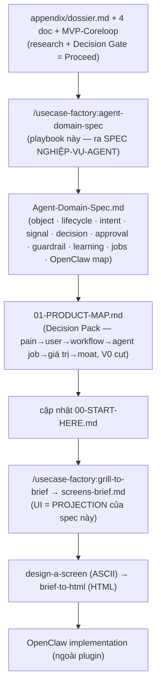

# Agent Domain Spec — Playbook

**Guide thực thi chính thức.** Skill router `/usecase-factory:agent-domain-spec` chỉ trỏ về file này; mọi logic chạy ở đây. Đọc hết trước khi chạy.

Nhiệm vụ: biến **research dossier + MVP core loop** thành một **Agent Domain Spec** — bản thiết kế **cách một nghiệp vụ được agent hóa, chạy trên runtime OpenClaw, TRƯỚC khi vẽ UI**. Output là `doc/ws-<slug>/Agent-Domain-Spec.md` (20 section, §0–§19). Đây là cầu nối research → nghiệp-vụ-agent; chạy SAU `/usecase-factory:run` (Decision = Proceed) và TRƯỚC `/usecase-factory:grill-to-brief`.



## Mô hình tư duy (giữ trong suốt)

- **Business process** — con người/quy trình làm việc ra sao. Research (4 doc + dossier) mô tả cái này.
- **Agent Domain Spec** — phần nào của quy trình giao cho **agent**, agent **tự chủ tới đâu**, **con người giữ kiểm soát rủi ro ở đâu**, và **OpenClaw chạy nghiệp vụ đó bằng primitive nào**. File này.
- **Screen brief** — cách **user nhìn thấy và điều khiển** nghiệp vụ. `grill-to-brief` vẽ, và nó là **projection** của spec này — không phát minh nghiệp vụ mới.
- **OpenClaw** = runtime/operating layer. Agent Domain Spec = SOP nghiệp vụ chạy trên OpenClaw.

## Nguyên tắc (luật load-bearing — đừng làm mềm)

1. **Trace, đừng bịa.** Mọi object / pain / intent / job trong spec phải truy về một dòng trong dossier hoặc 4 doc. Web không đỡ → ghi GAP ở §19, không phát minh nghiệp vụ.
2. **Anti over-automation là van an toàn lõi.** MỌI action phải phân loại **Auto / Cần duyệt / Cấm** (§11). **Phân vân → Cần duyệt.** Action đối ngoại / không đảo ngược / chạm tiền → mặc định Cần duyệt hoặc Cấm cho tới khi có bằng chứng tin cậy. Auto chưa biện minh = bug.
3. **Mọi action tự chủ phải có guardrail + fallback.** Không có rate-limit/scope-binding/data-minimization tương ứng (§14) hoặc không có nhánh confidence-thấp về im/hỏi (§10) → action đó chưa được phép tự chạy.
4. **Con người giữ rủi ro.** §2 phải gọi tên checkpoint người không thể bỏ; §11 phải có approval surface thật (§17) cho mọi "Cần duyệt".
5. **Không phần nào treo ngoài OpenClaw map.** §17 map từng phần (skills/tools/connectors/memory/sessions/cron/approval/guardrails/workspace state) trỏ ngược về section. Không hand-wave "agent tự lo".
6. **Lifecycle phải đóng.** §4 state machine: mọi state có đường vào + đường ra (hoặc là terminal), mọi transition có actor (agent/người/cron). State mơ hồ/chồng lấn/không tới được = lỗi — đóng trước khi grill.
7. **Learning không tự nới quyền.** §15: correction của user cập nhật rule/memory/mẫu — nhưng nâng một action từ Cần-duyệt → Auto là quyết định của NGƯỜI, không phải máy tự học.
8. **Spec ra quyết định, không chỉ tả.** Nếu nghiệp vụ không agent-hóa được an toàn (toàn rule cứng, hoặc mọi action đáng giá đều phải người làm) → nói thẳng, đề xuất quay lại Decision Gate (pivot/narrow), đừng gắng nặn spec rỗng.

---

## Step 1 — Resolve + đọc input (setup)

- Slug = arg. Workspace = `doc/ws-<slug>/`.
- **Đọc bắt buộc:** `appendix/dossier.md` (source of truth) + `appendix/MVP-Coreloop.md` (core loop §2 = spine) + `appendix/MR-*-Problem-Solution.md` (JTBD → intent) + `appendix/Target-User-*.md` (ai trong loop, ngưỡng lỗi → checkpoint người) + `appendix/Boi-Canh-Va-Van-De.md` (day-in-life → trigger/background job). Đọc `brief.md` nếu có (đừng suy lại core loop nó đã chốt). Đọc `00-START-HERE.md` để biết verdict + trạng thái pipeline hiện tại (file này sẽ được cập nhật ở Step 8).
- **Precondition (DỪNG nếu thiếu):** thiếu `dossier.md` hoặc `MVP-Coreloop.md` → nói rõ thiếu cái nào và dừng; không thể agent-hóa khi chưa có nghiệp vụ + vòng lặp.
- **Gate verdict:** chỉ chạy tiếp khi dossier §8 = **Proceed**. Pivot/Narrow/Kill → trình lại quyết định cho user, không tự vượt.

## Step 2 — Model nghiệp vụ (spawn `domain-modeler-agent`)

Spawn **`domain-modeler-agent`** (read-only; Read/Grep/Glob). Nó đọc workspace và trả về model thô: **core objects · lifecycle/state machine · intent taxonomy · signals · decision points · human-checkpoint candidates · gaps**. Đây là nguyên liệu cho §3–§8.

> Domain rộng → có thể spawn thêm một modeler cho một object-cluster khác (vd "phía khách" vs "phía vận hành") trong CÙNG một message. Modeler chỉ model + gọi tên decision point; nó KHÔNG quyết autonomy/approval (đó là việc của bạn ở Step 3, hardened ở Step 5).

Lấy report của modeler làm bàn cờ khởi điểm; show cho user trước khi derive sâu.

## Step 3 — Derive spec theo section (recommend-rồi-chờ ở các gate rủi ro)

Điền `Agent-Domain-Spec.md` từ template `templates/06-agent-domain-spec.template.md`, theo thứ tự section. Field *phụ* mà research/modeler đã trả lời → điền rồi đi tiếp. Nhưng **các gate rủi ro KHÔNG BAO GIỜ tự điền âm thầm** — trình đáp án recommend VÀ chờ confirm:

- **§2 Role split + autonomy line** — phần nào người / agent / tool; agent tự chạy tới đâu trước khi cần người.
- **§11 Approval policy** — mỗi action là Auto / Cần duyệt / Cấm. Đây là quyết định rủi ro lõi — confirm từng action đối ngoại / không đảo ngược.
- **§10 Confidence & fallback** — ngưỡng nào tự làm, nào đề xuất chờ duyệt, nào im/hỏi.
- **§14 Guardrails** — chặn spam / gửi nhầm / đọc-lưu quá mức / over-automate / prompt-injection.

Thứ tự derive (mỗi section bám section trước, không nhảy cóc):

1. **§1 Domain thesis** — agent làm nghề gì, KHÔNG làm gì (dẫn từ dossier §1 Agent Fit + core loop).
2. **§2 Role split** — bảng người/agent/tool trên từng bước nghiệp vụ + autonomy line + checkpoint người. *(gate)*
3. **§3 Core objects** — từ modeler; mỗi object trace về doc.
4. **§4 Lifecycle/state machine** — object chính: states · transitions (event → state, có actor) · terminal. Đóng vòng (luật 6).
5. **§5 Intent taxonomy** — phân loại tình huống + dấu hiệu + disposition; **bắt buộc có nhánh "không rõ / ngoài phạm vi"**.
6. **§6 Signals/features** — agent đọc signal nào (input/tool/context/memory) cho quyết định nào.
7. **§7 Eligibility rules** — điều kiện đưa object vào queue / được hành động / phải chờ người.
8. **§8 Decision policy** — bảng (intent + signal + state) → action; mỗi nhánh trỏ một action có thật ở §12 + một phân loại §11. Không nhánh nào "hành động mù".
9. **§9 Priority/scoring** — urgent/important/value/confidence tính ra sao (heuristic minh bạch, không cần ML ở v0).
10. **§10 Confidence & uncertainty** — bảng mức confidence → hành vi + fallback an toàn khi không chắc. *(gate)*
11. **§11 Approval policy** — bảng action → Auto/Cần duyệt/Cấm + approval surface. *(gate)*
12. **§12 Tool/action policy** — tool/connector nào, input cho phép, giới hạn, side-effect.
13. **§13 Draft/content policy** — nếu domain sinh nội dung: tone/length/versioning/lần-1-vs-lần-2; nếu không → "Không áp dụng".
14. **§14 Guardrails/anti-abuse/trust boundaries** — mỗi guardrail: chặn gì + cơ chế. *(gate)*
15. **§15 Learning loop** — correction nào → cập nhật rule/memory/state gì; ranh giới: không tự nới quyền.
16. **§16 Background jobs** — scan/classify/detect/retry/snooze/re-open/notify: trigger + làm gì + đổi state §4.
17. **§17 OpenClaw implementation map** — map từng phần sang primitive, trỏ ngược section (luật 5).
18. **§18 Metrics** — false positive/negative · approval rate · edit distance · action success · trust recovery.
19. **§19 Open questions/assumptions** — giả định/gap còn lại + biggest open risk → mang sang grill.

Capture vào file **ngay khi mỗi section chốt** — đừng dồn tới cuối.

## Step 4 — Self-check tính nhất quán (trước reviewer)

Tự soi, show kết quả (đừng tự sửa âm thầm cái cần user quyết):

- [ ] Mọi action ở §8 có một phân loại ở §11 và một tool ở §12?
- [ ] Mọi "Cần duyệt" §11 có approval surface ở §17?
- [ ] Mọi state §4 có đường vào + đường ra/terminal + actor cho mỗi transition? State trong §16 có mặt ở §4?
- [ ] Mọi action tự chủ (Auto) có guardrail tương ứng §14 + nhánh confidence-thấp §10?
- [ ] §17 map đủ 8 primitive, mỗi cái trỏ về section thật?
- [ ] Mọi object/intent/pain trace về dossier/4 doc (không bịa)?

## Step 5 — Adversarial check (spawn `agent-logic-reviewer`)

Spawn **`agent-logic-reviewer`** (read-only). Đưa nó `Agent-Domain-Spec.md` + dossier. Nó cố **refute**: over-automation, missing/weak approval gate, ambiguous/unreachable state, thin guardrail, confidence escape-hatch thiếu, learning loop nới quyền âm thầm, claim không trace, và (nếu đã có brief) mismatch spec ↔ screen-brief. Dùng dissent của nó để vá spec — nó cố vấn, bạn quyết. Nếu nó trả "hold" vì over-automation / thiếu approval gate → sửa trước khi handoff.

## Step 6 — Synthesize `01-PRODUCT-MAP.md` (Decision Pack)

Từ template `templates/07-product-map.template.md`, viết `doc/ws-<slug>/01-PRODUCT-MAP.md` — bản đồ quyết định sản phẩm MỘT TRANG cho product/người quyết định, KHÔNG phải research summary. Đây là PROJECTION của `Agent-Domain-Spec.md` + 4 doc research — rút, không lặp lại:

- **Chuỗi pain → user → workflow → agent job → giá trị kinh doanh → moat** — mỗi ô trỏ về một section cụ thể (`appendix/*.md` hoặc `Agent-Domain-Spec.md`). "Agent job" phải là MỘT câu trả lời được: người dùng thuê agent này để làm việc gì ĐAU và LẶP LẠI — giọng user, không phải giọng builder.
- **Core loop + agent hoạt động** — core loop (từ MVP-Coreloop §2), agent actions v0 (§8/§12), human approval points (§11), guardrails (§14), success metrics (§18).
- **KHÔNG build ở V0** — liệt rõ tính năng/action/screen bị hoãn có chủ đích (từ MVP-Coreloop §5 + Agent-Domain-Spec §19), kèm lý do. Đây là hàng rào chặn scope creep, không phải wishlist.
- **Rủi ro lớn nhất cần người quyết định tiếp** — một câu hỏi mở, từ dossier §7-§8 hoặc §19.

Không tự bịa thêm quyết định sản phẩm ở tầng này — ô nào không trỏ về được nguồn cụ thể là một giả định, ghi rõ.

## Step 7 — Validate + persist

Đảm bảo `doc/ws-<slug>/Agent-Domain-Spec.md` đủ 20 section, sạch placeholder, và `01-PRODUCT-MAP.md` tồn tại cạnh nó. Chạy:

```
bash ${CLAUDE_PLUGIN_ROOT}/scripts/validate-agent-domain-spec.sh doc/ws-<slug>/Agent-Domain-Spec.md
```

MISS nào → sửa rồi chạy lại tới khi PASS.

## Step 8 — Cập nhật `00-START-HERE.md`

Mở `doc/ws-<slug>/00-START-HERE.md` (đã có từ `/usecase-factory:run`) và cập nhật — KHÔNG tạo file mới, KHÔNG viết đè verdict/tóm tắt đã có:

- Routing table: xác nhận dòng "Product" trỏ tới `01-PRODUCT-MAP.md` và dòng "Builder" đã có `Agent-Domain-Spec.md`.
- Trạng thái pipeline: tick `agent-domain-spec`, thay dòng "Chưa có" của nó bằng "Xong — xem Agent-Domain-Spec.md + 01-PRODUCT-MAP.md".
- Cập nhật "Cập nhật lần cuối" (ngày + tên stage) ở dòng Verdict.

## Step 9 — Handoff sang grill-to-brief

Trình: spec đã ghi + product map + verdict reviewer + biggest open risk (§19). Bàn giao cho `/usecase-factory:grill-to-brief <slug>`:

- Screen brief phải là **PROJECTION của spec này** — mỗi màn surface một phần của nghiệp-vụ-agent: object/state user cần thấy, decision/approval cần một bề mặt, background job cần một thông báo. KHÔNG phát minh nghiệp vụ mới ở grill.
- Mỗi state user-thật-chạm ở §4/§8/§11 phải có một màn hoặc một bề mặt off-dashboard (chat/notification/approval queue) trong brief.

---

## Boundaries (hard)

- **KHÔNG vẽ màn / ASCII / HTML / screen-brief** — đó là grill-to-brief → design-a-screen → brief-to-html.
- **KHÔNG over-automate.** Mọi action phân loại Auto/Cần duyệt/Cấm; phân vân → Cần duyệt; đối ngoại/không đảo ngược/chạm tiền không tự lên Auto khi chưa có bằng chứng tin cậy.
- **KHÔNG để action tự chủ thiếu guardrail + fallback** (§14 + §10).
- **KHÔNG bịa nghiệp vụ** research không đỡ — trace về dossier/4 doc, thiếu thì ghi GAP §19.
- **KHÔNG để state mơ hồ / không đóng vòng** ở §4.
- **KHÔNG để learning loop tự nới quyền** (§15).
- **KHÔNG để phần nào treo ngoài OpenClaw map** (§17).
- **KHÔNG vượt Decision Gate** — chỉ chạy khi Proceed; verdict khác thì trình lại.
- **KHÔNG dồn write** — capture từng section ngay khi chốt.
- **KHÔNG để `01-PRODUCT-MAP.md` thành research summary** — mỗi dòng phải là một quyết định/chuỗi trace được, không phải chép lại dossier.

**Command này kết thúc khi:** `doc/ws-<slug>/Agent-Domain-Spec.md` tồn tại (đủ 20 section, validator PASS, mọi action đã phân loại approval + có guardrail, OpenClaw map đầy đủ, reviewer không còn "hold"), `01-PRODUCT-MAP.md` tồn tại cạnh nó, và `00-START-HERE.md` đã cập nhật routing + trạng thái pipeline.
