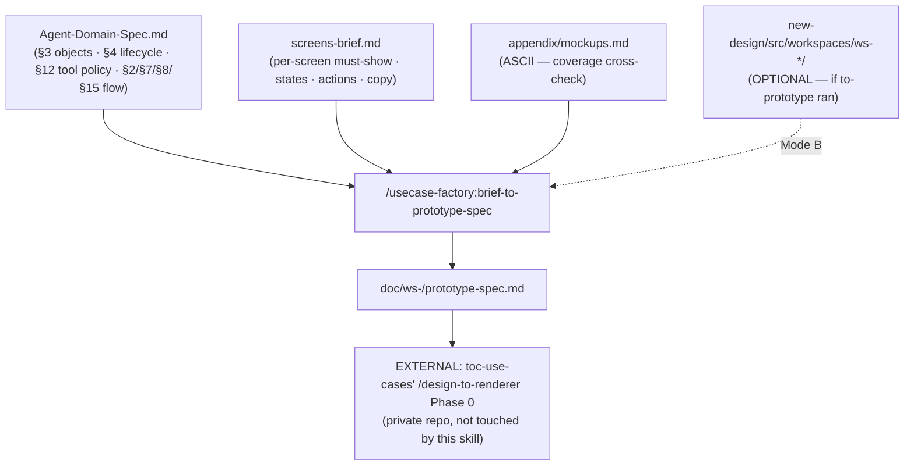

# Brief to Prototype Spec — Playbook

**Execution guide.** The router `/usecase-factory:brief-to-prototype-spec` only points here; all
logic runs in this file. Read start to finish before running.

Job: turn `Agent-Domain-Spec.md` + `screens-brief.md` (+ `appendix/mockups.md`, + optionally a real
`/usecase-factory:to-prototype` output) into `doc/ws-<slug>/prototype-spec.md` — a file shaped
exactly like the `prototype-spec.md` that the internal `toc-use-cases` repo's `design-to-renderer`
skill reads as its Phase-0 locked-design input, alongside `mockups.md`. This is a **one-way output
adapter**: it never reads from or writes to `toc-use-cases`/`use-case-renderers` — it only shapes
this repo's own artifacts to match their contract, confirmed by reading their real
`prototype-to-spec` skill + a real produced `prototype-spec.md` example.

## Why this section mapping is legitimate (read before doubting it)

`design-to-renderer`'s own `prototype-to-spec` upstream fills its 5 sections by reading a **real
running prototype** — code is ground truth there. We usually don't have that (the Prototype rung in
our own pipeline, `/usecase-factory:to-prototype`, is optional). But `Agent-Domain-Spec.md` is not a
guess either — it's a researched, reviewed (`agent-logic-reviewer`), traced-to-evidence model of the
same business objects/lifecycle/decision logic a real system would encode. So for the **Data
contract** section specifically, our upstream is *strictly richer* than what a thrown-together
`fixtures.js` stub usually reveals. For sections that genuinely need a running system to answer
(exact interaction ordering, optimistic-vs-confirmed UI nuance), we do NOT guess — we flag
`<<DEFER: grill>>` and let their own `grill-with-docs` resolve it, exactly as their `prototype-to-spec`
already expects unresolved contract fields to be marked.

## Step 1 — Resolve inputs, detect mode

- Slug = arg. Workspace = `doc/ws-<slug>/`.
- **Required (STOP if missing):**
  - `doc/ws-<slug>/Agent-Domain-Spec.md` — if absent, tell the user to run
    `/usecase-factory:agent-domain-spec` first (or confirm this workspace really has no domain
    spec, in which case §3 Data contract of the output will be far weaker — warn plainly, don't
    silently proceed as if nothing were lost).
  - `doc/ws-<slug>/screens-brief.md` — if absent, point to `/usecase-factory:grill-to-brief` (or
    `/usecase-factory:handoff-to-brief` for the alternate entry).
  - `doc/ws-<slug>/appendix/mockups.md` — if absent, point to `/usecase-factory:design-a-screen`.
- **Optional — detect Mode B:** does `new-design/src/workspaces/<ws>/` exist (i.e.
  `/usecase-factory:to-prototype` ran)? If yes → **Mode B**. If no → **Mode A**. Tell the user which
  mode you're running in and why.

## Step 2 — Scaffold the output

Copy `templates/09-prototype-spec.template.md` → `doc/ws-<slug>/prototype-spec.md`. Fill the header
banner: slug, display name, mode (A/B), generation date, and the explicit note that this file is
generated by `usecase-factory` for handoff into `toc-use-cases`' `design-to-renderer` — not a
substitute for grilling it against their own pipeline once there.

## Step 3 — Section 1: Screen inventory + component tree

- **Mode A:** one subsection per screen in `screens-brief.md`. List: screen id/name, its
  **Must-show** field (what occupies the region), its **Primary/Secondary action**, and cross-check
  against `appendix/mockups.md` for the actual ASCII layout regions (columns, master-detail split,
  tabs, etc.) — describe the layout shape from the ASCII, not a real component/class name (there is
  no real code yet). Mark the subsection heading `(inferred — no live prototype)`.
- **Mode B:** read `new-design/src/workspaces/<ws>/index.jsx` + each `<tab>.jsx` exactly like their
  `prototype-to-spec` does — list the real compose chain (`Built from: <ComponentX> › <ComponentY>`)
  and the source file path. This is mechanical; don't grill it.
- Every screen in `screens-brief.md`'s `## Screens (v0)` must appear here — if one doesn't, that's a
  coverage gap, not something to silently drop.

## Step 4 — Section 2: State machine (per screen)

- **Mode A:** for each screen, build the table `State | Meaning | Reached by (action)` from
  `screens-brief.md`'s per-screen `States:` field (empty/first-run/loading/error/done) and its
  `Primary action` / `Secondary` fields. Only write a trigger you can point to in the brief or the
  ASCII; anything genuinely ambiguous (e.g. an implied intermediate state the brief doesn't name a
  trigger for) → `<<DEFER: grill>>`.
- **Mode B:** read the real handlers in `<tab>.jsx` / `fixtures.js` for the REAL action, same as
  their skill — this is normally fully answerable from code, so DEFER markers should be rare here.
- No state without either a real trigger or an explicit DEFER — never assert a transition you
  inferred without a named cause.

## Step 5 — Section 3: Data contract (FE↔BE lock) — the section we're strong at

Build this primarily from `Agent-Domain-Spec.md`, not from screens-brief or a prototype guess:

- **Entity schema** — transform `Agent-Domain-Spec.md` §3 Core objects table (`Object | field agent
  quan tâm | nguồn`) directly into the contract's entity shape: one entity per core object, fields
  from the "field agent quan tâm" column.
- **Enums** — pull from §4 Object lifecycle's "States hợp lệ" list for the corresponding object's
  status-shaped field.
- **Side-effects / mutation surface** — cross-reference §12 Tool/action policy's side-effect column
  so the contract notes which fields a tool call, not just the UI, can mutate.
- **`sessionKey`-equivalent** — this is an OpenClaw/toc-use-cases-specific runtime concept
  (`agent:<id>:<channel>:direct:<peer>` in their convention). Our domain spec doesn't name one
  directly. **Only propose a candidate** if a §3 core object's "Khóa nhận dạng" (identifier key)
  column is plainly session/conversation-shaped (e.g. a Thread/Conversation object keyed by
  channel+peer) — state it as a proposal, not a lock. Otherwise `<<DEFER: grill>>` explicitly. Never
  invent a key shape with no traceable source — this field gates real backend work downstream.
- **Mode B addition:** if a real `fixtures.js` stub exists, read it too — but where it conflicts with
  `Agent-Domain-Spec.md`'s object model, surface the conflict as an open question rather than
  silently picking one. The domain spec is the more rigorous source; the prototype stub is a guess
  that predates it.

## Step 6 — Section 4: Interaction / flow notes

Pull from `Agent-Domain-Spec.md`:
- §2 Human/Agent/Tool role split — what the agent does automatically vs proposes vs never touches.
- §7 Eligibility rules — what gates an object into a workable queue.
- §8 Decision policy — what mutates what, and under what condition.
- §15 Learning loop — what user corrections feed back into (relevant if the UI ever surfaces "the
  agent learned X").

This section is normally the hardest for a prototype-only spec to fill (only a running system
reveals real interaction order) — here it's the opposite: our domain spec IS the decision logic, so
this section should usually come out fuller than a typical Mode-A/no-domain-spec attempt would
produce elsewhere.

## Step 7 — Section 5: Locked copy

Mechanical, no inference: pull `screens-brief.md`'s `## Copy register` table and each screen's
`Copy:` block (Page title / Subtitle / Section headings / Action labels / Empty-state) verbatim.
Group by screen, matching the target template's `- <area>: "<string>"` shape.

## Step 8 — Collect open questions

Gather every `<<DEFER: grill>>` emitted in Steps 3–6 into the output's `## Open questions` section.
This mirrors their own `prototype-to-spec`'s convention exactly, so if this file is handed to a team
running `grill-with-docs` on the `toc-use-cases` side, it already recognizes the marker — no new
convention to teach them.

## Step 9 — Handoff note (tell the user this explicitly, every run)

- `design-to-renderer`'s Phase 0 reads **`doc/ws-<name>/mockups.md` at the workspace root**. Ours
  lives at `doc/ws-<slug>/appendix/mockups.md`. **Do not silently copy or duplicate the file** —
  just tell the user plainly: when handing this workspace to a `toc-use-cases` clone, carry
  `appendix/mockups.md` alongside the new `prototype-spec.md`, placed at that workspace's root.
- Say which mode ran (A or B) and how many `<<DEFER: grill>>` markers were left — an honest count,
  not a bare "done".
- This output is NOT itself validated by any script in this repo (matching `screens-brief.md`'s own
  precedent — no dedicated validator). Its real acceptance test is whether `design-to-renderer` on
  the other side can consume it without asking for anything this file was supposed to answer.

## Anti-patterns

- Don't invent a `sessionKey` shape, an entity field, or a state-transition trigger with no
  traceable source — `<<DEFER: grill>>` exists precisely so this skill never launders a guess into a
  "locked" contract.
- Don't run Mode B extraction against a prototype that isn't locked (mid-edit) — treat it like their
  own `prototype-to-spec` does: distilling a moving prototype produces a stale spec.
- Don't silently copy `appendix/mockups.md` to the workspace root — that changes this repo's own
  file layout; just tell the user what the OTHER repo expects.
- Don't skip Section 3 (Data contract) just because `Agent-Domain-Spec.md` feels heavy to re-read —
  it's the one section this skill exists to make stronger than a prototype-only spec would be.
- Don't treat this skill's output as a Decision Pack artifact — it's a bridge file for an external,
  private pipeline; don't add it to `00-START-HERE.md`'s routing table or imply every user needs it.
