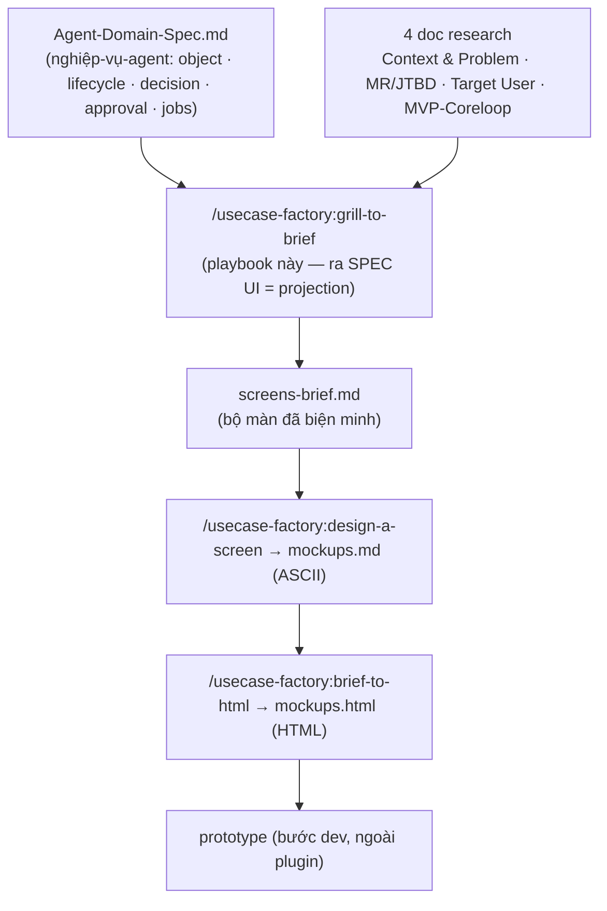

# Grill-to-Brief — Playbook

**Guide thực thi chính thức.** Skill router `/usecase-factory:grill-to-brief` chỉ trỏ về file này; mọi logic chạy ở đây. Đọc hết trước khi chạy.

Nhiệm vụ: biến **Agent Domain Spec + 4 doc research** thành một **Screen Brief** — bộ màn mà **mỗi màn phải tự kiếm chỗ đứng bằng cách giải đúng MỘT job, nhìn từ góc của target user**, và **surface một phần của nghiệp-vụ-agent đã chốt trong `Agent-Domain-Spec.md`**. Đây là cầu nối nghiệp-vụ-agent → wireframe; chạy TRƯỚC `/usecase-factory:design-a-screen`. Output là **SPEC** (danh sách màn đã biện minh), KHÔNG phải ASCII — `/usecase-factory:design-a-screen` mới vẽ ASCII từ brief này, rồi `/usecase-factory:brief-to-html` render HTML, rồi mới dựng prototype.

> **Screen brief là PROJECTION của Agent Domain Spec.** OpenClaw chạy nghiệp vụ; spec (`Agent-Domain-Spec.md`) là SOP nghiệp vụ; brief này là cách user *nhìn thấy và điều khiển* nghiệp vụ đó. Mỗi màn chiếu một lát của spec: object/state user cần thấy (§3/§4), decision/approval cần một bề mặt (§8/§11), background job cần một thông báo (§16). KHÔNG phát minh decision/action/state nghiệp vụ mà spec không có — nếu thấy thiếu, đẩy ngược về `/usecase-factory:agent-domain-spec`, đừng tự chế ở đây.



KHÔNG brainstorm tính năng. Lấy đúng cái spec + research nói user cần, rồi ép từng màn ứng viên cho tới khi nó hoặc tự biện minh được trước một job thật + một lát của spec, hoặc bị cắt.

## Input (đọc Agent Domain Spec + cả 4 doc trước tiên)

> **Input chính = `Agent-Domain-Spec.md`.** Đọc nó TRƯỚC: nó định nghĩa nghiệp vụ agent đã được agent-hóa thế nào (object/state/decision/approval/job). Mọi màn trace về một lát của spec này. **Thiếu `Agent-Domain-Spec.md`** (workspace cũ, chạy trước khi có tầng này) → **CẢNH BÁO MẠNH**: brief sẽ nông vì phải tự suy nghiệp vụ từ 4 doc, dễ bịa decision/approval/state không có thật. Đề xuất user chạy `/usecase-factory:agent-domain-spec <slug>` trước. Nếu user xác nhận chạy tiếp → **fallback** về 4 doc research (vẫn được, nhưng ghi rõ trong brief là "không có Agent Domain Spec — nghiệp vụ suy từ research, cần spec hóa sau").

Đọc từ `doc/ws-<slug>/appendix/` (hoặc nơi user chỉ) TRƯỚC khi hỏi bất cứ gì:

1. **Context & Problem** (vd `appendix/Boi-Canh-Va-Van-De.md`) — dòng đời các pain + vấn đề cốt lõi. Nguồn của **user-day moment** ("sáng: lướt inbox tồn qua đêm chưa trả").
2. **MR / Jobs-to-be-Done** (vd `appendix/MR-*.md`) — bảng JTBD đã chấm ưu tiên (J1, J2, …) theo Frequency × Pain × Willingness-to-pay, các giả thuyết giải pháp, scope MVP. Nguồn của **job nào đáng + ưu tiên**.
3. **Target User** (vd `appendix/Target-User-*.md`) — persona, hồ sơ nghiệp vụ, expertise, thiết bị, đặc điểm phân biệt. Nguồn của **mọi màn chấm qua góc nhìn của ai**.
4. **MVP & Core Loop** (vd `appendix/MVP-Coreloop.md`) — scope v0 đã chốt + core loop (vòng giá trị lặp user chạy: trigger → action → payoff → return). Nguồn của **MVP cut line** (màn nào v0 vs hoãn) và **màn nào gánh "pull" của loop** (màn loop là v0 bất di bất dịch). Nếu dự án giữ cái này trong `brief.md` → đọc ở đó.

Có `brief.md` (từ `/usecase-factory:use-case-brief`) → đọc luôn; đừng suy lại cái nó đã chốt.

Thiếu một trong bốn loại input → nói rõ thiếu cái nào và DỪNG — không thể neo màn nếu thiếu job list, persona, hay scope MVP/core-loop.

**Design system (BẮT BUỘC, resolve ngay từ đầu).** Pipeline luôn cần một design system làm nguồn *skin* cho mọi render downstream. **Design system thường nằm NGOÀI repo này** — mỗi team một bộ ở repo/vị trí riêng; `design-system/` trong repo chỉ là bộ **DEMO** để chạy out-of-box. Resolve **vị trí** theo thứ tự: bộ user chỉ tên (thường là absolute path/URL ngoài repo) → `$DESIGN_SYSTEM_ROOT` → bộ demo `design-system/`. **Không resolve được bộ nào → DỪNG, hỏi user trỏ tới một design system** (path/URL/Figma/Storybook). Cấu trúc bộ **KHÔNG cố định** (có thể chỉ là 1 file HTML đóng gói như `design-system/Openclaw_Design_System.html`) — nên **liệt file trong bộ rồi HỎI user file nào dùng cho tokens, file nào cho component** (đừng đoán `src/index.css`/`ui.jsx`). Nếu bộ là HTML đóng gói, chạy `bash ${CLAUDE_PLUGIN_ROOT}/scripts/extract-design-tokens.sh <file>` để có `tokens.css` cạnh source rồi trỏ vào file đó. Ghi **đúng path đã chốt** vào mục `## Design system` của brief để `/usecase-factory:design-a-screen` và `/usecase-factory:brief-to-html` đọc thẳng, khỏi hỏi lại. KHÔNG fallback "neutral default" âm thầm — đó là chính nguyên nhân HTML ra xấu khi không có skin.

## Nguyên tắc (lý do tồn tại của skill)

> **Một màn tồn tại để *target user này* tiến được một bước trên *một job* ở *một khoảnh khắc* trong ngày của họ.**

Nên mỗi màn trong brief phải trả lời được, bằng giọng user — không phải giọng builder:

- **Khoảnh khắc của ai** — trong ngày của target user, họ chạm màn này lúc nào? đang cố làm gì *ngay lúc đó*?
- **Job nào** — đẩy được JTBD / pain nào (cite J#)?
- **Một mục đích** — màn này để làm MỘT việc, gói trong một dòng. Cần chữ "và" → khả năng là hai màn.

Các failure mode skill này sinh ra để diệt:

- **Orphan screen** — màn không có job đứng sau (dựng vì "dashboard thì phải có chart"). Cắt, hoặc tìm job cho nó.
- **Uncovered job** — một JTBD ưu tiên CAO mà không màn nào phục vụ. Đó là lỗ hổng; thêm màn, hoặc biện minh job đó sống off-dashboard (chat/notification).
- **Dead-end CTA** — nút/hành động không có state kết quả: bấm xong không có gì downstream được khai. Mọi hành động phải gọi tên state hoặc màn nó sinh ra, nếu không thành nút chết trong prototype.
- **Uncharted flow** — một business flow nhiều bước (onboarding wizard, vòng drift → re-plan → confirm) mà không chuỗi state nào mô tả. Brief phải trace cả flow đầu-cuối, không chỉ màn rời rạc. Đây chính là cái thiếu khi "HTML có nút bấm chẳng dẫn đi đâu".

## Workflow

### 1. Map nguyên liệu thô (trước khi grill)

Từ các doc, dựng một bảng làm việc để grill — show cho user như bàn cờ khởi điểm:

- **Jobs** — kéo các dòng JTBD kèm ưu tiên (J1…Jn). Đánh dấu CAO vs còn lại.
- **Day-moment** — các dòng timeline từ doc Context (sáng / trong ngày / live / sau giờ …).
- **Persona constraint** — expertise (non-tech?), thiết bị (iframe nhúng? desktop? mobile?), tần suất (ghé hiếm vs power-tool), ngưỡng lỗi (một thao tác sai có mất tiền thật không?).
- **Channel split** — sản phẩm đã quyết một số hành động sống ở chat/notification, không phải dashboard chưa? (mô hình hybrid của brief, nếu có). Đây là phản biện mặc định cho mọi màn.

Rồi đề xuất một **first-cut screen list** — baseline là một màn / một job CAO. Recommend, rồi grill cho rụng/cắt bớt.

### 2. Grill từng màn một

Hỏi **một câu một lần, chờ trả lời, recommend đáp án cho mỗi câu.** Nếu doc đã trả lời một field *phụ* → điền từ doc rồi đi tiếp. Nhưng **các gate decision KHÔNG BAO GIỜ tự điền âm thầm dù doc có gợi ý** — PHẢI nêu ra + lấy confirm rõ ràng:

- chốt screen-set (danh sách nào canonical),
- screen-hay-không cho mỗi ứng viên (phản biện channel-split),
- mỗi lỗ hổng coverage + quyết định (thêm màn vs off-dashboard),
- MVP cut line.

Với mấy cái này: trình đáp án recommend VÀ chờ — doc nguồn dày là một gợi ý, không phải một xác nhận. Đi hết screen list; mỗi màn ứng viên giải, theo thứ tự:

1. **Purpose (một dòng).** "Màn này ĐỂ làm gì, một câu, từ phía user?" Loại giọng builder ("quản lý X"). Ép ra user outcome ("thấy khách nào đang chờ để không rớt ai"). Không nói nổi trong một dòng → tách hoặc cắt.
2. **Khoảnh khắc của ai.** "Trong ngày, target user mở màn này lúc nào, đang cố làm gì?" Neo vào một dòng timeline.
3. **Job nào (cite J#).** "Phục vụ JTBD nào? ưu tiên bao nhiêu?" Không có → orphan → cắt hoặc hạ cấp.
4. **Màn, hay không phải màn?** Thách mọi màn trước channel-split: "Cái này có thể là notification / một hành động trong chat / một route-call một-chạm thay vì màn không?" Nhất là với user non-tech, ghé hiếm — càng ít màn càng tốt. Một màn sống được chỉ khi user cần *thấy một tập thứ cùng lúc* hoặc *browse/so sánh* — cái chat không làm được.
5. **Must-show + actions, mỗi cái kèm outcome.** "Lần paint đầu, cái gì BẮT BUỘC hiện? Hành động chính DUY NHẤT là gì?" Nhiều must-show hoặc nhiều action ngang hàng = màn quá tải. Rồi với MỖI hành động (chính + từng phụ), gọi tên **cái nó sinh ra** — state kết quả hoặc màn nó route tới (`Lưu kế hoạch → S2.first-run`, `Duyệt → S3.done`, `Ghi nhận đã góp → modal nhập → S2 cập nhật`). CTA không có kết quả khai = dead-end: khai kết quả hoặc cắt. Đây là cái làm state machine + flow thành thật, thay vì sketch chỉ-happy-path.
6. **States — display VÀ outcome.** Hai loại, đều bắt buộc: (a) **display state** — empty / first-run / loading / error / done — cái nào quan trọng ở đây + mỗi cái trông ra sao (state non-happy là nơi màn vỡ; đừng bỏ qua); (b) **outcome state** — kết quả mỗi hành động ở bước 5 (xác nhận post-submit, validation-failed, dismissed, màn đã biến hình sau một CTA). Mọi state user thật chạm tới phải liệt ở đây — `/usecase-factory:design-a-screen` vẽ từng cái và `/usecase-factory:brief-to-html` render mỗi cái thành một mục riêng, nên thiếu một state ở đây = thiếu khắp downstream.
7. **Palette-gap (nếu có ràng buộc palette).** Nếu dự án giới hạn UI trong một bộ component/view-type cố định, gắn cờ mọi element màn này cần mà palette thiếu. Gọi tên việc bespoke sớm = giá trị cao.

Capture từng màn vào `screens-brief.md` **ngay khi nó được chốt** — đừng dồn tới cuối.

### 3. Two-way coverage check (cổng)

Sau khi grill xong các màn, chạy CẢ HAI chiều và show kết quả:

- **Jobs → screens.** Mọi JTBD ưu tiên CAO map tới ≥1 màn. Liệt mọi job CAO chưa phủ. Mỗi cái quyết CÙNG user: thêm màn, hoặc ghi nó phục vụ off-dashboard (chat/notification) — không bao giờ để hở âm thầm.
- **Screens → jobs.** Mọi màn map tới ≥1 job. Liệt mọi orphan. Cắt, hoặc gắn job cho nó.
- **Actions → destinations.** Mọi hành động trên mọi màn map tới một outcome state hoặc màn đã khai. Liệt mọi **dead-end CTA** (nút chẳng dẫn đâu). Khai kết quả hoặc cắt nút — dead-end ở đây thành nút chết trong prototype. Rồi xác nhận mỗi job CAO trace được qua ≥1 flow đầu-cuối (bước 5).

### 4. MVP cut line

Lấy doc **MVP & Core Loop** (input #4) làm xương sống và ưu tiên MR làm tiebreak, kẻ vạch: màn nào v0 (phục vụ job CAO / gánh pull của core-loop) vs hoãn (phục vụ job trung/thấp). Màn nằm trên core loop là v0 bất di bất dịch. Nói rõ ra — cut line là cái chặn `/usecase-factory:design-a-screen` vẽ mười hai màn khi bốn màn đã ship được loop.

### 5. Navigation shape (nhẹ) + flows (bắt buộc)

**Nav shape (nhẹ):** một đoạn — các màn v0 nhóm thế nào, user di chuyển giữa chúng ra sao (top tab / left rail / wizard / master-detail)? Giữ nhẹ; `/usecase-factory:design-a-screen` mới đào sâu layout nav.

**Nav & headings spec (cho external generator):** sau khi đã có nav shape + copy pass (bước 7), gom vào mục `## Nav & headings spec` một khối paste-được: top nav (shape + danh sách items đúng thứ tự) và bảng `màn → page title → section headings`. Đây là cái đưa cho tool vẽ ngoài (pencil…) **kèm design system, KHÔNG kèm ASCII** — cho máy *ý định nav + nhãn* thay vì *tranh ASCII* để tránh anchoring xấu.

**Flows (bắt buộc, KHÔNG nhẹ):** vẽ các business flow đầu-cuối dưới dạng chuỗi state-transition, lắp từ các action-outcome bắt ở bước 2. Một dòng / một flow, vd:
- *Onboarding:* `S1.b1 → b2 → b3 (đề xuất) → b4 (xác nhận) → Lưu → S2.first-run`
- *Drift → re-plan:* `notification → S3.review → (Duyệt) → S3.done → S2.home (đã cập nhật)`
- *Off-track edit:* `S2.card lệch → S3.review → (Chỉnh tay) → S3.edit → Lưu → S2.home`

Mọi job CAO phải trace được qua ≥1 flow. Một chuỗi dead-end ở CTA không có state kế tiếp chính là cái bug bước này bắt — đóng nó ở đây, trước khi vẽ. Flow là spec mà `/usecase-factory:design-a-screen` phải render mọi state của nó và bước prototype (ngoài plugin) phải làm chạm-tới-được bằng hành động thật.

### 6. Viết brief

Viết `doc/ws-<slug>/screens-brief.md` theo contract dưới (template: [`templates/05-screens-brief`](templates/05-screens-brief.template.md)). Đây là artifact `/usecase-factory:design-a-screen` tiêu thụ.

### 7. Copy pass (chạy `/usecase-factory:copy-writer`)

Sau khi bộ màn đã chốt, làm một **pass microcopy** trên đó với `/usecase-factory:copy-writer` — text trên-sản-phẩm mỗi màn cần, để `/usecase-factory:design-a-screen` và `/usecase-factory:brief-to-html` khỏi bịa label vứt-đi. Copy chấm qua CÙNG lăng kính target-user (§ Target user lens) — register, expertise, ngưỡng jargon đều lấy từ doc persona.

Mỗi màn, `/usecase-factory:copy-writer` sinh ra và bạn ghi vào block **Copy** của màn (contract dưới):

- **Page title** — label sentence-case, 1–4 từ, không chấm cuối, không emoji.
- **Subtitle** — MỘT câu (≤ ~12–14 từ) nói user ĐƯỢC gì ở đây, không phải tính năng. Bỏ nếu title tự rõ; không lặp lại title.
- **Section headings** — tiêu đề nhóm h2 trong trang (đứng độc lập, không sub-subtitle).
- **Action labels** — chính + phụ dạng động-từ-mạnh + danh-từ-cụ-thể ("Xác nhận chốt", không phải "OK").
- **Empty-state line** — một câu cho state empty/first-run.

Áp luật `/usecase-factory:copy-writer` nguyên văn: one-line-two-sides (ý định user × giá trị sản phẩm), front-load động từ, sentence case cho VI+EN, không emoji/gạch chéo trong label, register tiếng Việt chuyên-nghiệp-nhẹ (vd "bàn giao" không "nhường", "Trả lời" không "trả tin"). Nếu dự án đã ship string sẵn (file i18n, `mockups.data.js` đang có) → reconcile về chúng — polish, đừng fork copy mới.

Bước này là một LỚP copy phủ lên spec, không phải vẽ lại — nó không bao giờ đổi màn nào tồn tại hay màn để làm gì (cái đó đã khoá ở bước 2–4).

### 8. Cập nhật `00-START-HERE.md`

Mở `doc/ws-<slug>/00-START-HERE.md` (đã có từ `run` + `agent-domain-spec`) và cập nhật — KHÔNG tạo file mới, KHÔNG viết đè verdict/tóm tắt/product-map đã có:

- Routing table: xác nhận dòng "Builder" đã trỏ tới `screens-brief.md` (chuỗi `Agent-Domain-Spec.md` → `screens-brief.md` → `mockups.html`).
- Trạng thái pipeline: tick `grill-to-brief`, thay dòng "Chưa có" bằng "Xong — xem screens-brief.md".

## The Screen Brief contract

> Field key + section heading giữ NGUYÊN (khớp gold-standard `screens-brief.md` thật — `/usecase-factory:design-a-screen` đọc đúng shape này). Chỉ value điền tiếng Việt.

```
# Screen Brief — ws-<slug>

> Phase: bridge (research → wireframe). Source: <context doc> · <MR doc> · <target-user doc> · <MVP-coreloop doc> [· brief.md]
> Feeds: /usecase-factory:design-a-screen (ASCII) → /usecase-factory:brief-to-html (HTML) → prototype.
> This is a SPEC (justified screen set), NOT ASCII. No code, no layout.

## Design system (REQUIRED — skin source for every render; ASK which files, don't assume layout)
- Location: <folder / URL — default repo design-system/, or user-named / $DESIGN_SYSTEM_ROOT>
- Tokens file: <exact file the user confirmed — e.g. design-system/Openclaw_Design_System.html>
- Components file: <exact file the user confirmed — may be the same as tokens file>
- Buildable palette: <component set — the constraint design-a-screen scores palette-gaps against>

## Target user lens (one line)
<who the screens are judged from — role, expertise, device, frequency, error-tolerance>

## Channel split (if any)
<what lives on the dashboard vs in chat/notifications — the default counter-argument to each screen>

## Screens (v0)

### S1 — <name>
- Purpose (1 line): <user outcome, not builder verb>
- Serves: J<#> (<priority>) [+ J<#>]
- User-day moment: <when / what they're doing right then>
- Must-show: <first-paint essentials>
- Actions (each → its outcome): primary=<verb+noun> → <result state / screen> · secondary=<…> → <result> · <…>
- States — display: empty=<…> · first-run=<…> · loading=<…> · error=<…> · done=<…>
- States — outcome (from the actions above): <action → state it produces, e.g. "Duyệt → done (kế hoạch đã cập nhật)"; list every reachable result, or "none — terminal">
- Why a screen (not chat/notification): <justification>
- Palette-gap: <bespoke component needed, or "none">
- Copy (via /usecase-factory:copy-writer — step 7):
  - Page title: <sentence-case, 1–4 words>
  - Subtitle: <one sentence, WHAT the user gets, or "—" if title self-evident>
  - Section headings: <h2 group titles inside the page>
  - Action labels: primary=<verb+noun> · secondary=<…>
  - Empty-state: <one sentence>

### S2 — …
（repeat per screen）

## Coverage check
| Job | Priority | Served by | Note |
|-----|----------|-----------|------|
| J1  | High     | S1, S3    | |
| J2  | High     | (chat)    | off-dashboard — after-hours auto-reply, no screen |
| …   |          |           | |
- Uncovered HIGH jobs: <none | list + decision>
- Orphan screens: <none | list + decision>
- Dead-end CTAs: <none | list + decision (define result state or cut)>

## MVP cut line
- v0 (ship the loop): S1, S2, …  — why
- Deferred: <screen> — serves J<#> (<lower priority>)

## Flows (state-transition chains)
<one line per end-to-end flow: screen.state → action → screen.state → … ; every HIGH job traceable through ≥1 flow; no chain dead-ends at a CTA without a next state>

## Navigation shape (light)
<one paragraph + grouping list — /usecase-factory:design-a-screen explores this deeper>

## Nav & headings spec (for external generator — pencil…)
<copy-paste block to hand an external generator WITH the design system, NOT with ASCII. Intent-level, not pixels.>
- Top nav: <shape> — items: <Label 1 · Label 2 · …> (order; first = active)
- Per-screen headings (table): | Screen | Page title | Section headings (h2) |

## Open questions for /usecase-factory:design-a-screen
- <layout/IA/state question to resolve while drawing>
```

## Anti-patterns (Boundaries — hard)

- **KHÔNG vẽ ASCII.** Skill này ra spec; `/usecase-factory:design-a-screen` vẽ. Vượt vạch đó = trùng skill kế + bỏ qua bước nó khám phá layout song song.
- **KHÔNG nhận purpose giọng builder.** "Quản lý sản phẩm" không phải purpose; "tìm đúng sản phẩm khách hỏi mà không rời chat" mới là. Ép ra outcome của user.
- **KHÔNG để màn phục vụ zero job** (orphan) hay **để job CAO phục vụ zero màn** (lỗ hổng) — two-way coverage check là cổng, chạy nó.
- **KHÔNG mặc định mọi thứ thành màn.** Với user non-tech, ghé hiếm, một notification hay hành động một-chạm thường thắng một màn. Bắt mỗi màn thắng cuộc tranh luận đó.
- **KHÔNG bịa màn research không đỡ.** Trace mọi màn về một JTBD/pain trong doc; không có trong doc thì không vào v0.
- **KHÔNG phát minh nghiệp vụ ngoài Agent Domain Spec.** Có `Agent-Domain-Spec.md` → mỗi màn là projection của một lát spec (object/state §3-4, decision/approval §8/§11, job §16). Thấy cần một decision/action/state spec không có → đẩy ngược về `/usecase-factory:agent-domain-spec`, đừng tự chế logic nghiệp vụ ở tầng UI.
- **KHÔNG bỏ qua state non-happy** — empty/first-run/error là chỗ layout thật sự phải chạy được.
- **KHÔNG để CTA thiếu state kết quả.** Mọi hành động gọi tên state hoặc màn nó sinh (bước 5); kết quả không khai = nút chết downstream. Coverage check Actions→destinations là cổng.
- **KHÔNG ship brief thiếu flows.** Màn rời rạc chỉ-display-state là cái lỗ làm prototype trông "thiếu state / flow chưa xong". Vẽ chuỗi state-transition đầu-cuối (bước 5) — mọi job CAO trace qua một flow.
- **KHÔNG ship brief thiếu MVP cut line** — thiếu nó, `/usecase-factory:design-a-screen` vẽ thừa.
- **KHÔNG dồn write** — capture từng màn vào file ngay khi grill (ghi tăng dần, không gom tới cuối).
- **KHÔNG để doc nguồn dày thay cho grill.** Dù `brief.md` đã liệt sẵn màn, các gate decision (screen-set, screen-hay-không, lỗ hổng, cut line) vẫn nêu + confirm từng cái một. Tự điền từ doc rồi viết file một phát = phá skill — user phải trong vòng lặp ở mọi quyết định đáng kể.

**Command này kết thúc khi:** `doc/ws-<slug>/screens-brief.md` tồn tại — mọi màn đã grill (purpose · moment · job · actions+outcomes · states), two-way coverage sạch (không orphan / không job CAO hở / không dead-end CTA), MVP cut line đã kẻ, flows vẽ đầu-cuối, copy pass đã áp, và `00-START-HERE.md` đã cập nhật routing + trạng thái pipeline.

## Bộ vàng tham chiếu

`doc/ws-sale-ai-agent/screens-brief.md` (trong repo use-case, **nếu có** — không ship kèm plugin) — case đã grill hết. Phân vân field contract điền gì → mở nó ra.
