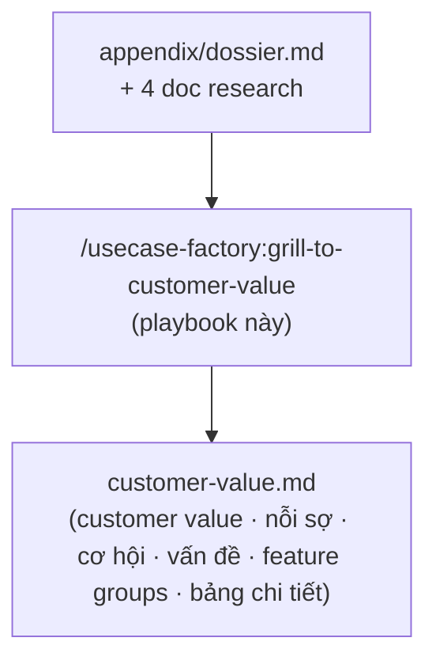

# Grill-to-Customer-Value — Playbook

**Guide thực thi chính thức.** Skill router `/usecase-factory:grill-to-customer-value` chỉ trỏ về file này; mọi logic chạy ở đây. Đọc hết trước khi chạy.

Nhiệm vụ: biến **dossier + 4 doc research** thành một **Customer Value & Fear Map** — trả lời dứt khoát ba câu hỏi mà không tài liệu nào trong 4 doc trả lời thẳng: *khách mua vì cái gì (customer value cốt lõi)*, *khách sợ gì tới mức không dùng*, và *feature nào là bắt buộc để giải nỗi sợ đó / để giá trị đó thực sự tới tay khách*. Output là một **bản đồ đã hội tụ qua một cuộc grill thật** (không phải một bản tóm tắt research), nên file cuối cùng phải mang theo cả hành trình hội tụ, không chỉ kết luận.



Skill này **KHÔNG nằm trong pipeline bắt buộc**. `agent-domain-spec` và `grill-to-brief` không đọc `customer-value.md` tự động và không chờ nó. Nó tồn tại vì một lý do riêng: nghiên cứu (4 doc) tả đúng *cái gì đang xảy ra* (pain, thị trường, persona), nhưng không ép ai phải *chọn ra* cái gì là cốt lõi nhất trong đống đó. Grill làm việc đó — bằng cách buộc một cuộc hội thoại thật đi tới hội tụ, thay vì liệt kê phẳng mọi khả năng.

## Nguyên tắc (lý do tồn tại của skill)

> **Một customer value/nỗi sợ chỉ được ghi vào bản đồ cuối cùng nếu nó sống sót qua một cuộc chất vấn thật — không phải vì nó xuất hiện trong doc.**

Khác với 4 doc research (nhiệm vụ là *phủ hết* mọi bằng chứng), nhiệm vụ của skill này là *thu hẹp* — ép tới khi chỉ còn lại một vài thứ không thể cắt thêm nữa. Doc dày là nguyên liệu thô, không phải câu trả lời sẵn.

Ba lớp grill, chạy TUẦN TỰ trong một buổi (không được bỏ lớp nào):

1. **Đóng vai (persona simulation).** Claude tự chọn MỘT persona + MỘT khoảnh khắc cụ thể (không phải persona chung chung) từ 4 doc, rồi tự trả lời trong vai đó — "Nếu tôi là [persona], lúc [khoảnh khắc], tôi..." — để mồi ra nguyên liệu thô bám bằng chứng dossier, thay vì hỏi user một câu hỏi trừu tượng ("customer value là gì?") mà chưa có gì cụ thể để phản ứng lại.
2. **Phỏng vấn (interview).** Draft ở lớp 1 chắc chắn có chỗ sai hoặc thiếu — vì Claude không có trực giác thị trường thật của user. Hỏi user từng câu một, đúng chỗ mà *chỉ user mới trả lời được* (case thật họ biết, ngưỡng chấp nhận thật, thứ tự ưu tiên thật) — không hỏi lại thứ 4 doc đã có sẵn.
3. **Thu hẹp (narrowing).** Sau khi có đủ nguyên liệu (đóng vai + phỏng vấn), chạy một chuỗi câu hỏi ép hội tụ — "chọn 3", "chọn 2", "chọn 1", "nếu KHÔNG có cái đó thì sao" — luân phiên Claude đề xuất rồi user xác nhận/sửa, cho tới khi câu trả lời ổn định (không đổi qua 2 vòng liên tiếp).

**Ngưỡng tối thiểu:** tổng số câu hỏi (lớp 2 + lớp 3 cộng lại, không tính câu Claude tự hỏi-tự-trả-lời ở lớp 1) phải **≥ 12**, khuyến khích 15–20 nếu vùng vấn đề rộng (nhiều persona, nhiều nỗi sợ tranh nhau vị trí #1). Đây không phải thủ tục hình thức — mục đích là để **user tự hiểu ra** customer value qua chính quá trình trả lời, không chỉ đọc kết quả cuối. Dừng sớm hơn ngưỡng này = chưa được viết phần chốt (mục 1, 3, 6, 7 của contract).

## Input

Đọc từ `doc/ws-<slug>/appendix/` (hoặc nơi user chỉ) TRƯỚC khi hỏi bất cứ gì:

1. **`dossier.md`** — Evidence Table (§3, các claim gắn nhãn must-cite/infer/assumption), Substitute/Workaround Map (§5, nguồn của **cơ hội** — khe nào đối thủ/workaround chưa lấp), Assumptions and Risks (§7).
2. **Context & Problem** (vd `Boi-Canh-Va-Van-De.md`) — dòng đời pain theo khung giờ/khoảnh khắc trong ngày. Nguồn của **khoảnh khắc** dùng để đóng vai.
3. **MR / Jobs-to-be-Done** (vd `MR-<slug>-Problem-Solution.md`) — bảng JTBD đã chấm ưu tiên (J1, J2…). Nguồn của **vấn đề** (mục 5 contract) và neo J# cho mọi nỗi sợ/feature.
4. **Target User** (vd `Target-User-<slug>.md`) — persona, hồ sơ, đối thủ đang phục vụ ai. Nguồn của **persona** dùng để đóng vai và nguồn của **cơ hội** (khe đối thủ chưa lấp, nếu doc có phần định vị đối thủ).
5. **MVP & Core Loop** (vd `MVP-Coreloop.md`) — scope v0. Dùng để không đề xuất feature nằm ngoài mọi khả năng build được.

Có `brief.md` → đọc luôn, đừng suy lại cái nó đã chốt.

**Thiếu một trong bốn loại doc research → nói rõ thiếu cái nào và DỪNG** — không thể grill khi chưa có JTBD, persona, hay dòng đời pain.

## Workflow

### 1. Map nguyên liệu thô (trước khi đóng vai)

Dựng nhanh một bảng làm việc (hiện cho user thấy, không giấu):

- **Personas có trong Target User doc** — nếu chỉ một persona chính, dùng nó; nếu nhiều persona đáng kể, liệt ra và hỏi user muốn grill persona nào trước (một câu, không phải cả một gate).
- **Khoảnh khắc** — kéo các dòng timeline từ Context doc (sáng/trong ngày/live/tối…), mỗi dòng kèm pain cụ thể.
- **Jobs (J1…Jn)** kèm ưu tiên, từ MR doc.
- **Substitute/Workaround Map** từ dossier §5 — cái gì "đủ tốt" đang chặn khách chuyển sang agent (đây là nguồn của **nỗi sợ kiểu kinh tế**: sao phải đổi cái đang chạy được).

### 2. Chọn + công bố persona/khoảnh khắc

Chọn MỘT persona + MỘT khoảnh khắc cụ thể ăn khớp với job ưu tiên CAO nhất (không phải job ngẫu nhiên). Công bố rõ, một câu:

> "Tôi sẽ đóng vai [persona], vào lúc [khoảnh khắc cụ thể — vd 'tối muộn, ngồi xem lại tin nhắn tồn từ trưa'], để tìm customer value/nỗi sợ. Nếu bạn thấy persona/khoảnh khắc này chưa đúng trọng tâm, nói ngay."

Đây KHÔNG phải một gate chờ xác nhận dài — chỉ là minh bạch trước khi bắt đầu. Nếu user redirect (persona khác, khoảnh khắc khác), đổi ngay và tiếp tục.

### 3. Đóng vai — tự trả lời trước (Lớp 1)

Trong vai persona đã chọn, TỰ TRẢ LỜI (giọng "tôi", ngôi thứ nhất, cụ thể — không phải giọng builder/phân tích) các câu hỏi sau, bám bằng chứng dossier + 4 doc, gắn nhãn evidence (must-cite/infer/assumption) cho mỗi claim đáng kể:

- "Tôi mua/dùng cái này vì lý do gì?" (kéo nhiều lý do, đừng chốt lý do duy nhất ở đây — đó là việc của lớp 3)
- "Nếu tôi KHÔNG mua/không dùng, lý do gì?" — mồi ra nỗi sợ thô
- "Tôi đang thấy đối thủ/cách làm hiện tại (workaround) thiếu gì mà tôi ước có?" — mồi ra cơ hội
- "Trong ngày của tôi, đâu là lúc đau nhất mà chưa ai giải quyết được?" — mồi ra vấn đề

Đây là DRAFT để mồi, không phải kết luận — nói rõ với user đây là "giả thuyết ban đầu, cần bạn chỉnh". Không được viết thẳng vào `customer-value.md` ở bước này.

### 4. Phỏng vấn (Lớp 2)

Từ draft ở bước 3, xác định những chỗ **chỉ user mới trả lời được** — điển hình:

- Case thật user đã gặp (khách hàng cụ thể, phản hồi thật) mà 4 doc chưa có — như một dữ kiện độc lập nặng ký hơn suy luận thị trường.
- Thứ tự ưu tiên thật giữa các nỗi sợ/giá trị mà docs không xếp hạng được (docs có JTBD priority cho *vấn đề*, nhưng không có priority cho *nỗi sợ* — đó là phán đoán kinh doanh của user).
- Ngưỡng chấp nhận được / đánh đổi thật (user sẵn sàng chịu rủi ro gì để đổi lấy lợi ích gì).
- Bất kỳ tín hiệu thị trường mới hơn dossier (case khách hàng gần đây, phản hồi group, competitor mới).

Hỏi **một câu một lần, chờ trả lời**, không hỏi lại thứ doc đã trả lời rồi. Recommend một hướng trả lời dựa trên draft lớp 1 rồi để user xác nhận/sửa — giống style `grill-to-brief`, nhưng câu hỏi ở đây nhắm vào phán đoán kinh doanh, không phải quyết định UI.

### 5. Thu hẹp (Lớp 3 — cổng hội tụ)

Đây là lớp quan trọng nhất, không được rút ngắn. Chạy một chuỗi câu hỏi ép hội tụ, luân phiên Claude đề xuất — user xác nhận/sửa:

- Từ danh sách thô (lớp 1+2), hỏi: "Nếu chọn 3 nỗi sợ lớn nhất, là gì?"
- Thu hẹp tiếp: "Nếu chỉ chọn 1?"
- Đảo chiều để kiểm tra: "Ngược lại — cái gì KHÔNG có thì bạn/khách sẽ KHÔNG mua/không dùng?"
- Ép về một câu duy nhất: "Nói đơn giản trong một câu, customer value là gì?"
- Paraphrase lại câu trả lời của user và hỏi xác nhận lần nữa — đây là phép thử ổn định.

**Điều kiện dừng thu hẹp:** customer value cốt lõi VÀ nỗi sợ #1 mỗi cái phải **không đổi qua 2 câu hỏi liên tiếp** (kể cả khi diễn đạt lại khác đi, ý phải giữ nguyên). Chưa ổn định → tiếp tục hỏi, không tự chốt. Đạt ổn định trước khi đủ ngưỡng 12 câu (mục Nguyên tắc) → vẫn tiếp tục hỏi thêm ở các nhánh phụ (cơ hội, vấn đề, feature) cho tới khi đạt ngưỡng, KHÔNG dừng sớm chỉ vì hai gate lớn nhất đã xong.

**Không bao giờ tự chốt các gate sau mà không hỏi user, dù draft lớp 1 nghe hợp lý tới đâu:**
- Customer value cốt lõi (mục 1 contract)
- Nỗi sợ #1 / dealbreaker (mục 3 contract)
- Feature nào là "must" (mục 6, 7, 8 contract)

### 6. Derive feature groups

Từ nỗi sợ đã hội tụ (mục 5) và customer value cốt lõi, đề xuất (recommend, rồi hỏi confirm — một lượt là đủ, không cần grill sâu như lớp 3 vì hai gate lớn đã ổn định):

- Mỗi nỗi sợ đã rank → MỘT nhóm feature giải nó (tên nhóm + lý do một câu, KHÔNG thiết kế UI/flow chi tiết — đó là `agent-domain-spec`/`grill-to-brief`).
- Customer value cốt lõi → MỘT hoặc vài nhóm feature đảm bảo nó thực sự tới tay khách (không chỉ tồn tại trên giấy).

### 7. Bảng chi tiết (feature-centric)

Từ mục 6, dựng bảng traceability — mỗi dòng một feature, cột: `Feature | Giải nỗi sợ nào | Deliver value nào | Vấn đề/Job gốc | Ưu tiên | Evidence`. Một feature có thể vừa giải nỗi sợ vừa deliver value (ghi cả hai cột). Ưu tiên lấy theo J# priority (MR doc) làm neo, override bằng phán đoán user ở lớp 2 nếu có xung đột — ghi rõ khi override.

### 8. Viết `customer-value.md`

Viết `doc/ws-<slug>/customer-value.md` theo contract dưới (template: [`templates/10-customer-value`](templates/10-customer-value.template.md)) TĂNG DẦN theo từng mục đã hội tụ — đừng dồn tới cuối. Mục 9 (Hành trình grill) phải phản ánh trung thực chuỗi câu hỏi thật đã hỏi, không phải viết lại gọn ghẽ sau khi biết đáp án.

### 9. Cập nhật `00-START-HERE.md` (nếu có, không bắt buộc)

Nếu `doc/ws-<slug>/00-START-HERE.md` đã tồn tại (từ `run`/`agent-domain-spec`/`grill-to-brief`) → thêm MỘT dòng trong bảng routing trỏ tới `customer-value.md`, không viết đè verdict/tóm tắt đã có, không tạo file này nếu chưa tồn tại (vì skill độc lập, không phải điều kiện tiên quyết của Decision Pack).

## The Customer Value contract

> Field key + section heading giữ NGUYÊN. Chỉ value điền tiếng Việt.

```
# Customer Value & Fear Map — ws-<slug>

> Phase: grill (persona simulation + interview) — ĐỘC LẬP, không bắt buộc trong pipeline chính. Chạy được bất cứ lúc nào sau /usecase-factory:run.
> Source: appendix/dossier.md · <context doc> · <MR doc> · <target-user doc> · <MVP-coreloop doc> [· brief.md]
> Số câu hỏi đã hỏi trong buổi grill: <n> (ngưỡng tối thiểu 12)

## 0. Persona concept đã chọn
- Persona: <trích Target User doc>
- Khoảnh khắc: <trích Context doc — timeline cụ thể>
- Vì sao chọn: <1-2 câu — neo vào job ưu tiên CAO nhất>

## 1. Customer value cốt lõi
- Một câu: <core value — lý do sâu nhất khách mua, không phải feature>
- Điều kiện "không làm được thì vứt": <cái duy nhất, thiếu nó thì mọi giá trị khác vô nghĩa>
- Evidence: <must-cite/infer/assumption + ID dossier nếu có>
- Đã ổn định qua ≥2 vòng thu hẹp: <có/không — nếu không, ghi rõ vì sao vẫn ghi vào đây>

## 2. Giá trị của agent app (theo lớp)
| Lớp giá trị | Mô tả | Evidence |
|---|---|---|
| Chức năng (functional) | <...> | <...> |
| Kinh tế (economic) | <...> | <...> |
| Niềm tin (trust/emotional) | <...> | <...> |

## 3. Nỗi sợ (ranked, #1 = dealbreaker)
| # | Nỗi sợ | Vì sao (root cause) | Job/vấn đề gốc | Mức độ |
|---|---|---|---|---|
| 1 | <...> | <...> | J<#> | Dealbreaker |
| 2 | <...> | <...> | J<#> | Manageable |
| … | | | | |

## 4. Cơ hội
| Cơ hội | Vì sao đối thủ/workaround chưa lấp | Nguồn |
|---|---|---|
| <...> | <...> | <dossier §5 / Target-User đối thủ> |

## 5. Vấn đề (pain thực tế — phân biệt với nỗi sợ cảm nhận ở mục 3)
| Vấn đề | Job (J#) | Ưu tiên | Nguồn |
|---|---|---|---|
| <...> | J<#> | Cao/TB/Thấp | <...> |

## 6. Tính năng lớn — giải nỗi sợ
- <tên nhóm feature> → giải nỗi sợ #<n> — <lý do 1 câu>

## 7. Tính năng lớn — deliver customer value
- <tên nhóm feature> → deliver customer value cốt lõi (mục 1) — <lý do 1 câu>

## 8. Bảng chi tiết (feature-centric traceability)
| Feature | Giải nỗi sợ nào | Deliver value nào | Vấn đề/Job gốc | Ưu tiên | Evidence |
|---|---|---|---|---|---|
| <...> | <#n hoặc "—"> | <có/không> | J<#> | Must/Should | must-cite/infer/assumption |

## 9. Hành trình grill (tóm tắt hội tụ)
<tóm tắt trung thực: bắt đầu từ đâu (draft lớp 1), câu hỏi nào đổi hướng, vì sao hội tụ về kết quả này — không chỉ chép lại kết luận>
- Điểm hội tụ customer value: <câu hỏi/vòng nào làm nó ổn định>
- Điểm hội tụ nỗi sợ #1: <câu hỏi/vòng nào làm nó ổn định>

## 10. Related
- <link dossier, 4 doc, brief.md>
- Gợi ý dùng tiếp (không bắt buộc, không skill nào tự đọc file này): nỗi sợ ở mục 3 có thể tham khảo thủ công khi chạy /usecase-factory:agent-domain-spec (đầu vào cho guardrail/approval policy); customer value ở mục 1 có thể tham khảo khi chạy /usecase-factory:grill-to-brief (đầu vào cho purpose của từng màn).
```

## Anti-patterns (Boundaries — hard)

- **KHÔNG tự chốt gate lớn.** Customer value cốt lõi, nỗi sợ #1, feature must-have — luôn recommend rồi hỏi, kể cả khi draft lớp 1 (đóng vai) nghe rất thuyết phục. Doc dày hay persona rõ không phải lý do bỏ qua xác nhận.
- **KHÔNG hỏi lại thứ 4 doc đã trả lời.** Lớp 2 (phỏng vấn) chỉ hỏi chỗ docs không trả lời được — hỏi lại JTBD priority sẵn có trong MR doc là lãng phí câu hỏi và loãng buổi grill.
- **KHÔNG dừng thu hẹp (lớp 3) sớm.** Customer value/nỗi sợ #1 phải ổn định qua ≥2 vòng liên tiếp mới được ghi vào mục 1/3 của contract như đã chốt.
- **KHÔNG dưới 12 câu hỏi tổng (lớp 2+3).** Mục đích của skill là user tự hiểu ra qua quá trình, không phải chỉ nhận một file kết quả nhanh.
- **KHÔNG lẫn nỗi sợ (mục 3, rủi ro cảm nhận — "sợ mất khách") với vấn đề (mục 5, pain thực tế đang xảy ra — "trả lời chậm ban đêm").** Hai bảng riêng vì hai loại bằng chứng khác nhau: nỗi sợ tới từ phỏng vấn/đóng vai, vấn đề tới từ JTBD table có sẵn.
- **KHÔNG thiết kế UI/feature chi tiết.** Mục 6/7 chỉ là TÊN nhóm feature + lý do một câu. Xuống level flow/state/màn là việc của `agent-domain-spec` và `grill-to-brief` — lấn sang đó là trùng skill kế.
- **KHÔNG bịa claim không đỡ được.** Brainstorm là mục đích cốt lõi (khác `grill-to-brief`, vốn cấm brainstorm), nhưng mọi dòng trong bảng vẫn phải gắn nhãn must-cite/infer/assumption — brainstorm không có nghĩa là bỏ kỷ luật bằng chứng, chỉ có nghĩa là được phép suy luận xa hơn dossier miễn dán đúng nhãn "infer"/"assumption".
- **KHÔNG dồn viết.** Ghi từng mục vào `customer-value.md` ngay khi nó hội tụ, không gom tới cuối buổi.
- **KHÔNG viết lại mục 9 (hành trình grill) sau khi đã biết đáp án cuối** — nó phải phản ánh đúng trình tự câu hỏi thật, kể cả những nhánh cụt/bị bác bỏ giữa chừng.

**Command này kết thúc khi:** `doc/ws-<slug>/customer-value.md` tồn tại đủ 10 mục — persona đã chọn, customer value cốt lõi đã ổn định ≥2 vòng, nỗi sợ đã rank và ổn định ≥2 vòng, cơ hội + vấn đề đã liệt kê có nguồn, feature groups cho cả nỗi sợ và customer value đã có, bảng chi tiết feature-centric đầy đủ cột, tổng số câu hỏi ≥ 12, và mục hành trình grill phản ánh trung thực quá trình hội tụ.
