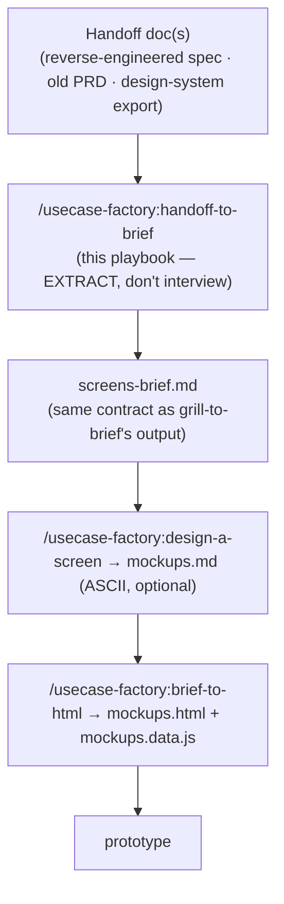

# Handoff to Brief — Playbook

**Official execution guide.** The router `/usecase-factory:handoff-to-brief` only points here; all logic runs in this file. Read it fully before running.

Job: turn a **handoff doc for a product that already exists** (a reverse-engineered spec of a live app, an old PRD, a design-system export with a screen-by-screen breakdown) into a `screens-brief.md` that is byte-for-byte the same contract `/usecase-factory:grill-to-brief` produces — so `/usecase-factory:design-a-screen` and `/usecase-factory:brief-to-html` run against it unmodified. The difference from `grill-to-brief` is the source of truth: `grill-to-brief` justifies a screen set against research for an idea nobody has decided yet; this skill **extracts** a screen set that a real, already-decided product already has.

Do NOT re-derive product decisions the doc already made. Do NOT run a market/JTBD interview — there is no undecided idea here. The failure mode this skill exists to avoid is the opposite of `grill-to-brief`'s: not "inventing screens nobody asked for," but **silently dropping or silently deciding** something the source doc left ambiguous, flagged, or genuinely open.

## When NOT to use this skill

If the user is shaping or validating something that doesn't exist yet — even if they hand you a competitor's app, a moodboard, or a rough sketch as *inspiration* — that's `/usecase-factory:run` (optionally seeded by `/usecase-factory:use-case-brief`), not this skill. The tell: does the doc describe a product **decision that's already been made** (a real app's actual behavior, states, copy), or is it evidence toward a decision **still being made**? Only the former belongs here. If unsure, ask the user directly before starting.

## Input

`/usecase-factory:handoff-to-brief <slug> <path to the handoff/design doc(s)>`

Read the ENTIRE doc (or doc set) before asking anything — including any table of contents, appendices, and "known issues" sections. A handoff doc worth writing this skill for is usually long; skimming it produces a shallow brief exactly like skipping the 4 research docs would in `grill-to-brief`. If the doc references sibling files it says it doesn't fully cover (e.g. "read these 4 source files directly before implementing this screen" — read them too, or tell the user you're deferring that screen and why.

There is no fixed shape for a handoff doc. What you're looking for, however it's organized:

1. **A design system** — tokens (color/type/spacing/radius/shadow/motion) and component shapes (buttons, cards, chips, inputs). Some docs embed this as literal CSS custom properties (the best case — you can point downstream straight at the doc's own section); others point at a separate file/repo/Figma.
2. **A screen/view inventory** — an enumerable list of pages, tabs, modals, and drawers, ideally in some navigational order.
3. **Per-screen intent** — for each: what it's for, what must be visible on first paint, what actions it offers and where they lead, what states it has (empty/loading/error/done and per-action outcomes), and its copy (titles, labels, CTAs).
4. **Navigation / IA** — how screens group and how a user moves between them (tabs, rail, wizard, master-detail, routing switch).
5. **Known gaps or flags** — anything the doc itself marks as inconsistent, dead/unmounted, not-yet-decided, or explicitly out of scope. These are gold: they are exactly the genuine gaps you must surface to the user rather than silently resolve.

If the doc is missing (1) entirely — no tokens, no pointer to a design system at all — treat this the same as `grill-to-brief`'s hard stop: you cannot hand `brief-to-html` a skin-less brief. Ask the user to point at one before writing the brief (see Step 2).

## Workflow

### 1. Build the raw inventory (before writing anything)

From the doc, build a working table and show it to the user as the starting board, same spirit as `grill-to-brief`'s "first-cut screen list":

- **Screen/view list**, in the doc's own order, each tagged with the doc's own status marker if it uses one (e.g. `[LIVE]` / `[DEAD]` / `⚠ FLAG` / "needs follow-up"). If the doc doesn't use such markers, assume everything described is in-scope unless it reads as explicitly historical/unused.
- **Design system pointer(s)** — where tokens live, where component shapes live (may be the same file, may be two different sections of the same doc).
- **Known-open items** — every inconsistency, orphaned/dead code path, or "decide before building this" note the doc itself calls out.

Recommend a **first-cut in-scope screen list** (shipped/live screens only, by default) and confirm it — this is a gate decision, do not silently include or exclude anything without saying so out loud, especially:
- `[DEAD]` / unmounted / historical sections → recommend EXCLUDING by default; state why; let the user pull one back in if they actually want it built.
- Sections the doc itself says weren't fully speced ("needs follow-up read", "partial") → recommend deferring; don't invent the missing depth yourself.
- `⚠ FLAG` inconsistencies (a copy bug, a promised-but-unbuilt option, a decorative stub with no handler) → don't silently pick a resolution. Surface each one and ask: keep the flagged behavior as-is, fix it in the brief, or defer the decision — then record the answer.

### 2. Resolve the design system (hard gate — same rule as the rest of the pipeline)

Same resolution order as `grill-to-brief`/`design-a-screen`/`brief-to-html`: the location the user names → `$DESIGN_SYSTEM_ROOT` → the repo's bundled demo `design-system/`. Two cases:

- **Tokens are embedded in the handoff doc itself** (literal `--token-name: value` listings, light + dark) — this is the easy case. Point the brief's `## Design system` section straight at the handoff doc + the section/heading that holds them; no extraction script needed, `brief-to-html` can read a plain token listing verbatim.
- **The doc only references an external design system** (a path, a repo, a Storybook/Figma link, a bundled HTML export) — resolve its location, list its files, and **ask the user which file holds tokens and which holds component shapes** — never assume. If it's a bundled/self-contained HTML export, tell the user to expect `brief-to-html` to run `extract-design-tokens.sh` on it later; you don't need to run it yourself at this stage.

**None resolvable → STOP and ask.** Do not write a brief that points at nothing — that produces exactly the skin-less render this pipeline forbids.

### 3. Extract each in-scope screen (fill the SAME S# block `grill-to-brief` uses)

Work the confirmed in-scope list one screen at a time, filling `${CLAUDE_PLUGIN_ROOT}/skills/grill-to-brief/templates/05-screens-brief.template.md`'s per-screen fields — extracting, not asking, except where noted:

- **Purpose (1 line):** the doc usually describes screens in builder voice ("the marketplace grid embedded under the empty chat hero"). Re-voice it from the user's side ("browse other agents without leaving the current chat"). If a screen's doc description already reads as two purposes joined by "and", treat it as two screens, same rule as `grill-to-brief`.
- **Serves:** name the underlying user job in plain words directly from the doc's own framing of why the screen exists. There is no validated JTBD table behind this doc, so label it plainly — e.g. `Serves: browse/install an agent (from handoff doc, not a validated JTBD)` — so nobody downstream mistakes it for researched priority.
- **User-day moment:** take it verbatim if the doc states one (e.g. "the very first thing an unauthenticated visitor sees"); otherwise infer conservatively and label it `(inferred)`.
- **Must-show:** the doc's own enumerated elements/sections for that screen, in the order it lists them.
- **Primary/secondary actions + outcome:** pull straight from the doc's described click targets and, critically, its flow/routing notes — handoff docs for real products usually already state exactly where a button goes (a numbered flow like "install → step 1 signed out → stash pick → open login → resume install"). That IS the outcome; don't re-derive it, transcribe it.
- **States:** both display states (empty/loading/error/first-run/done, including any the doc marks `[DEAD]`/not-implemented) and outcome states per action. If the doc describes a state but doesn't fully spec its look, note that as a `Palette-gap` or an open question rather than inventing detail.
- **Why a screen (not chat):** usually self-evident for an existing product (it already ships as a screen) — state briefly why in one clause (multi-item browse/compare, persistent workspace) rather than skipping the field.
- **Palette-gap:** flag anything bespoke the doc describes that a generic design-system component set wouldn't cover (custom-drawn avatar/illustration systems, a non-standard chart, a bespoke gauge) — same value as in `design-a-screen`: naming the bespoke-build work early.
- **Copy:** reuse the doc's copy **verbatim** — title/subtitle/section headings/action labels/empty-state text. Do not invent new product copy. If the doc documents copy in more than one language, preserve that fact rather than normalizing to one language (note it as an open decision if the doc itself flags inconsistent i18n coverage).

Persist each screen to `screens-brief.md` as soon as it's extracted — don't batch to the end, same discipline as `grill-to-brief`.

### 4. Two-way coverage check (adapted for a source doc instead of a JTBD table)

`grill-to-brief` checks Jobs↔Screens; this skill checks **doc↔brief** instead, same two-way spirit:

- **Doc → brief:** every screen/view the doc enumerates as in-scope (per Step 1's confirmed list) has a matching `S#` block. List anything dropped and why (excluded as `[DEAD]`, deferred as under-specified, merged into another screen).
- **Brief → doc:** every `S#` traces to a doc heading/section — flag (don't silently keep) any screen you find yourself elaborating beyond what the doc actually says.
- **Actions → outcomes:** every action extracted in Step 3 names a destination state. If the doc describes an action but never states its outcome (this happens — decorative/stub actions do exist in real products, and the source doc may even flag them as such), do not invent one: record it as an explicit open item ("doc doesn't specify; ask product / defer") rather than a dead-end CTA slipping through silently.

### 5. MVP cut line

If the doc already states which configuration is the intended shipped default vs. a demo-only/optional toggle (many reverse-engineered specs do — a "shipped defaults" or "production configuration" section), that split usually **is** your v0/deferred line: recommend it directly, cite the doc section, and confirm. If the doc has no such split, ask the user for one — same gate-decision rule as `grill-to-brief`, never silently pick a cut line on a large screen set.

### 6. Navigation shape + `## Nav & headings spec`

Lift the nav shape (tabs/rail/wizard/master-detail), the top-level nav items in order, and each screen's page title + section headings straight from the doc's own IA description (sidebar structure, tab configuration, routing switch) — this is usually one of the most literally-transcribable sections, since real products already committed to one IA.

### 7. Copy pass

Run `/usecase-factory:copy-writer` ONLY for genuine gaps — fields the doc doesn't already give verbatim copy for. Where the doc has real copy, that copy IS the answer; rewriting it would be inventing product copy the pipeline forbids.

### 8. Persist + finalize `00-START-HERE.md`

Write `doc/ws-<slug>/screens-brief.md` (Steps 3–7, incrementally). Then write `doc/ws-<slug>/00-START-HERE.md` using the shape of `${CLAUDE_PLUGIN_ROOT}/skills/run/templates/08-start-here.template.md`, adapted for this entry path:

- Replace the **Verdict** section with a **Source** section: name the handoff doc(s) (path), state plainly that this workspace skipped `run`/`agent-domain-spec` because the product decision predates the doc (not because a stage was forgotten), and name the excluded/deferred scope from Step 1.
- In the role-routing table, drop the `Agent-Domain-Spec.md` row (it doesn't exist for this workspace and never will, by design) and point builders straight at `screens-brief.md` → `mockups.html`.
- Keep **Scope**, **Bước kế / Next step**, and **Design system đã dùng** sections working exactly as in the normal pipeline, filled progressively as `design-a-screen`/`brief-to-html` run.
- Tick a pipeline-status checklist reading `handoff-to-brief` (done) → `design-a-screen` (optional) → `brief-to-html`, instead of `run` → `agent-domain-spec` → `grill-to-brief` → …

## Anti-patterns

- **Don't interview field-by-field when the doc already answers the field.** That's needless friction that exists in `grill-to-brief` only because nobody has decided the product yet. Here, most fields are extraction; only genuine gaps get a question.
- **Don't launder the doc's own flagged uncertainty into confirmed fact.** A `[DEAD]`, `⚠ FLAG`, "needs follow-up", or "not yet implemented" marker in the source must carry into the brief as an explicit note or an open question — never silently smoothed over.
- **Don't include `[DEAD]`/orphaned/historical screens as if they're real build targets** — default to excluding them, and say so, per Step 1.
- **Don't retroactively invent a JTBD framework.** Label extracted "jobs" as sourced from the handoff doc, not a validated research table — keep the provenance honest.
- **Don't skip the design-system STOP-and-ask gate just because the doc looks complete.** If tokens are ambiguous, split across sections you're unsure about, or the doc points at a file you don't have, still stop and ask.
- **Don't silently pick which screens ship in v0 on a large doc.** That's a gate decision — recommend, then confirm, same as `grill-to-brief`'s MVP cut line.
- **Don't draw ASCII or render HTML yourself.** Those are `/usecase-factory:design-a-screen` and `/usecase-factory:brief-to-html`, unmodified, reading the exact same `screens-brief.md` contract this skill produces.
