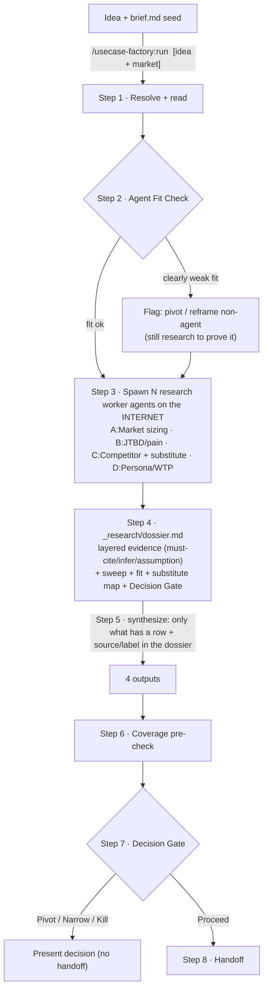

# Agent Playbook — Use-Case Factory

**Official execution guide.** The `/usecase-factory:run` router only names the steps; every bit of logic lives here. Read it fully before running.

Job: turn **one AI Agent use-case idea** (+ market) into **four research docs** + **one verdict** (Proceed / Pivot / Narrow / Kill) ready for downstream grilling. The factory does not just emit pretty research docs — it must **end with a decision**. Output converges from real internet market research (fan-out web search → fetch sources → adversarially verify → cite URLs), gathered into a structured dossier, and only then synthesized + decided.



> A vault / `brief.md` is **not a research source**. It is an optional **seed**: read it to know what is already decided (core loop, scope, positioning) and to avoid contradicting it. Market data (size, competitors, pain, pricing) comes from the **internet**.

## Principles

1. **The internet is the research engine.** Market sizing, competitors, pain, WTP all come from the web. The vault only seeds internal context.
2. **Cite by LAYER, not by sentence.** Classify every claim:
   - **MUST-CITE** (URL required): market size, pricing, competitor traction, regulation, buyer budget, adoption level, real pain quotes. Important ones → adversarially verify across ≥2 independent sources; divergent → record both; one source → `single`; not checked → `unverified`.
   - **INFER** (reasoned, no URL needed but labelled "infer"): workflow shape, typical persona behavior, UX assumptions.
   - **ASSUMPTION** (must be labelled unverified): willingness-to-pay, urgency, switching behavior, integration feasibility, operational ROI.
3. **Dossier first, output second.** Output may only state claims that have a row + source/label in the dossier. The dossier is the single source of truth for the 4 outputs AND for the decision.
4. **Never fabricate.** Web/vault doesn't have it → mark assumption/GAP + write the open question. Better to say "unknown". Never invent a stat / price / market size / traction.
5. **Agent fit is a gate, not a ritual.** If the workflow needs no judgment / multi-step / memory / messy conversation / proactive follow-up / human checkpoint → fit is weak → say so plainly: pivot, or reframe as non-agent automation.
6. **The factory renders a verdict.** End at the Decision Gate: Proceed / Pivot / Narrow / Kill. Never default blindly — neither "Proceed" nor "Narrow". Proceed = "good enough to grill" (does NOT require verified WTP); only downgrade for a real reason (Step 7).
7. **Substitutes > direct competitors.** List every way the audience solves the problem today (including "do nothing"). A free + good-enough workaround = weak pain = pivot/kill signal.
8. **One source of truth for core loop + scope.** If a `brief.md` exists, take core loop + cut line from it; the MVP doc only expands (internal product decision, NOT web research). Only re-derive if the brief is internally contradictory.
9. **JTBD ≠ screen spec.** The J# table scores priority + coverage; it does not map 1:1 to screens.
10. **Never hide weak evidence.** Single-source / unverified / assumption → mark it clearly, don't bury it.

---

## Step 1 — Resolve + read (setup, NOT research yet)

> This is **not** the research step. Real research starts at **Step 3** (workers go to the internet). Step 1 is ~30s of setup + reading what's already known, so Step 3 aims at the **GAP** and doesn't re-dig what the brief already settled. No market numbers are produced here.
>
> - **Resolve** = from `slug` (arg) → lock the workspace path `doc/ws-<slug>/` + create the output folder.
> - **Read** = read existing **internal seed** (`brief.md`, prior research) to know what is decided + avoid contradiction. NOT a data source.

- Slug = first arg token. Workspace = `doc/ws-<slug>/`. Create `doc/ws-<slug>/_research/` if missing.
- **Read `brief.md`** if present (one-liner, business, target audience, problem, CORE LOOP, MVP scope) — to bound the research + avoid contradiction. NOT a data source.
- **Read prior research/output** if it exists — do NOT overwrite good content; only fill gaps. Note changes in the dossier.
- **Research preconditions** — do NOT spawn workers until all four are present:
  1. use-case idea
  2. target market
  3. target user / buyer (hypothesis)
  4. problem / pain (hypothesis)
  Missing → take from `brief.md`; still missing → short interview, **max 5 questions, one at a time** (what is the business · for whom · where is the pain · which market · who pays).
- Identify the **gap**: what the brief already has vs. what needs research → directs Step 3.

## Step 2 — Agent Fit Check (early filter)

Answer BEFORE burning deep research: **why must this be an AI Agent, instead of plain SaaS / simple automation / chatbot / human VA / manual process?**

Score 6 axes (Yes / Weak / No):

- Needs **judgment** (not hard rules)?
- Needs **multi-step tool use** (chained tools/steps)?
- Needs **memory / context** across interactions?
- Handles **messy natural-language conversation**?
- Needs **proactive follow-up**?
- Benefits from a **human-in-the-loop checkpoint**?

- **Strong fit** → continue normally.
- **Weak fit** (most axes Weak/No) → do NOT hard-stop, but raise a flag: research still runs to prove/disprove it, and the Decision Gate (Step 7) leans toward **Pivot use-case** or **reframe as non-agent automation** (plain SaaS/automation/chatbot). Record the argument in dossier §1.

> This is a filter, not an idea-selling ritual. Score honestly. Weak fit that still says "Proceed" is a bug.

## Step 3 — Spawn parallel research worker agents (auto fan-out)

**Spawn in parallel** (one message, multiple Agent calls). Use the bundled worker agents (they have WebSearch + WebFetch and are read-only). Default **4 workers** — one dimension each, each running its own deep-research pass:

| Worker | Agent type | Dimension | What it researches on the web | Feeds |
|---|---|---|---|---|
| **A** | `market-sizing-researcher` | Market sizing & context | TAM/SAM or proxy · market maturity · growth signal · budget holder · regulatory/contextual constraints | `Boi-Canh-Va-Van-De.md` + `Target-User §3` |
| **B** | `jtbd-pain-researcher` | JTBD / pain | pain from forums/reviews/social/job posts/case studies · current workflow · existing workaround · pain frequency/intensity | `Boi-Canh §2` + `MR §1` |
| **C** | `competitor-substitute-researcher` | Competitor + substitute/workaround | direct competitors · **every substitute/workaround** · pricing · traction · gaps/moat | `MR §4` + dossier §5 |
| **D** | `persona-wtp-researcher` | Persona / WTP | buyer/user/admin/blocker · demographics/firmographics · WTP proxy · buying channel · trust barriers | `Target-User §1, §2, §4, §6, §7` |

> **Broad domain → split into more workers.** E.g. `C1` local competitors + `C2` global competitors. Each worker is a mini deep-research; let a worker fan out further on a dimension that needs depth.

### Worker C — substitute/workaround (must be exhaustive)

Worker C does NOT only look for direct AI competitors. It must sweep EVERY way the audience solves the problem today:

- direct AI tool · vertical SaaS · agency/freelancer · staff/admin (human labor) · Google Sheets/Excel · **"do nothing"**.
- **For Vietnamese SME audiences → MANDATORY to examine:** Zalo, Facebook, TikTok, e-commerce marketplaces, Google Sheets/Excel, manual inbox follow-up.
- Each substitute: how they solve it, cost (money/effort), strengths, weakness (the gap we slot into). Pricing/traction → URL, or label infer/assumption.

### Worker report contract (every worker must return this)

```
Agent:               <A/B/C/D...>
Scope:               <research dimension>
Search queries used: <query angles>
Sources fetched:     <list of URLs>
Key findings:        <bullets>
Evidence table:
  - claim
  - LAYER: must-cite / infer / assumption
  - URL (must-cite) | "—" (infer/assumption)
  - source type
  - date (if any)
  - numbers/quote summary
  - verify status: ✓ / single / unverified (must-cite only)
  - maps to output section
Contradictions:      <divergent sources, record both>
Gaps:                <web can't answer → primary research>
Recommended synthesis: <suggestions for output>
```

**Verification rule (mandatory in every worker prompt):**

- Important **must-cite** claims need **≥2 independent sources** or get marked `single`. Not verified → `unverified`.
- **infer** claims → say "infer" + the reasoning basis; never fake a source.
- **assumption** claims (WTP, urgency, switching, integration, ROI) → label as assumption; never launder into fact.
- No good source for a must-cite → record a **GAP**; do not infer a number.

## Step 4 — Build `_research/dossier.md`

Gather all worker reports into the dossier (template `templates/00-research-dossier.template.md`). **The dossier is the single source of truth for the 4 outputs + the decision.** Headings 0–9 are a CONTRACT:

```
## 0. Input
## 1. Agent Fit Check          ← from Step 2 (refine with post-research evidence)
## 2. Sweep Log                ← proves the mechanism ran
## 3. Evidence Table           ← each claim tagged LAYER must-cite/infer/assumption
## 4. Evidence Strength        ← multi-source / single / inferred / assumption / contradictions
## 5. Substitute / Workaround Map  ← every way it's solved today, incl. "do nothing" (VN SME: Zalo/FB/TikTok/marketplace/Sheets/manual)
## 6. Output Mapping
## 7. Assumptions and Risks    ← gaps + risk assumptions + biggest unresolved risk
## 8. Decision Gate            ← Proceed / Pivot / Narrow / Kill + rationale + confidence + top evidence IDs + biggest risk
## 9. Handoff Recommendation   ← downstream may reject/kill/narrow/pivot + grill checklist
```

Rule: **output may only state what has a row + source/label in the dossier.** Every must-cite claim has a source; infer/assumption are labelled.

## Step 5 — Synthesize 4 outputs from the dossier

Copy templates `01`–`04`, fill WITH evidence (+ URL/label) from the dossier, write into `doc/ws-<slug>/`:

| Template | → Output | Notes |
|---|---|---|
| `01-context-problem` | `Boi-Canh-Va-Van-De.md` | day-in-the-life (§2) from worker B + core problem |
| `02-mr-problem-solution` | `MR-<slug>-Problem-Solution.md` | JTBD (§1) + hypothesis (§2) + **competitors + substitute/workaround (§4)** from worker C + §0 layered evidence |
| `03-target-user` | `Target-User-<slug>.md` | persona from worker A (§3) + worker D (§1,2,4,6,7) |
| `04-mvp-coreloop` | `MVP-Coreloop.md` | core loop + cut line — **take from brief.md if present**, NOT web research |

Synthesis rules:

- Only write claims that **have evidence/label in the dossier**. Must-cite must trace to dossier/source; infer/assumption clearly labelled.
- Never fabricate numbers.
- Remove every `<!-- guidance -->` + `<placeholder>`. Keep source URLs in the doc (as links).
- Microcopy/titles: professional-light, plain Vietnamese, no emoji.

## Step 6 — Coverage pre-check (self-run)

A draft of the downstream grill gate — report the result table, do NOT add screens:

- [ ] Does every **HIGH job** (MR §1) have enough material to become ≥1 screen?
- [ ] Is the **core loop** (MVP §2) closed + does it have pull?
- [ ] Does each loop step trace to a job?
- [ ] Does the **persona** cover ≥4 axes (expertise · device · error tolerance · visit frequency)?
- [ ] Does each **HIGH pain** have a source (URL + verify) or get marked assumption?
- [ ] Are **competitor + substitute/workaround** complete (MR §4 / dossier §5)? Examined "do nothing" + (VN SME) Zalo/FB/Sheets?
- [ ] Is **WTP / pricing** evidenced or only assumption? (state clearly)
- [ ] Was **agent fit** (dossier §1) scored honestly?

## Step 7 — Decision Gate (pick exactly ONE)

This is why the factory exists. BUT remember the factory is a **gate into the grill, NOT a gate into build**. Proceed = "confident enough to be worth grilling", NOT "validated to build". The grill + brief is where WTP/buyer/feasibility get interrogated.

### WTP rule (read before scoring)

WTP / urgency / switching / ROI are **almost never verifiable via web** — they are primary research (interviews). At the factory stage they are **always = assumption**. Therefore:

> **Unverified WTP is NOT a reason to refuse Proceed.** It becomes **risk question #1 carried into the grill**, not a gate-closer. If "WTP not verified" blocks Proceed, then EVERY greenfield idea ends as Narrow → the gate is useless. Only downgrade Proceed for a REAL reason below (weak pain / substitute wins / wrong fit / broad scope), not for missing WTP.

### 4 branches — distinguishing criteria

- **Proceed** *(default for a healthy idea)* — real agent-fit + real pain (sourced) + a gap exists (substitute NOT clearly winning). Unverified WTP/buyer is **normal** → Proceed with the flag "WTP = top risk to grill".
- **Narrow buyer/market** — fit + pain + gap are all fine, BUT the **buyer/market is too broad to grill effectively** (e.g. 3 industries × 4 channels, or "solo broker vs. marketplace" are two different problems). Narrow because of **broad scope**, NOT because "WTP unverified".
- **Pivot use-case** — a free/cheap substitute **clearly wins** (good enough + already habitual, with evidence the audience won't switch) OR **agent-fit is weak** (reframe as non-agent automation/SaaS/chatbot).
- **Kill** — **no pain worth paying for** / no gap / fit clearly wrong → stop.

### Decision tree (in order)

1. Weak agent-fit? → **Pivot** (reframe non-agent).
2. Pain not worth paying / no gap? → **Kill**.
3. Substitute clearly wins (not just "exists" but *good enough + audience won't switch*)? → **Pivot**.
4. Buyer/market too broad to grill? → **Narrow**.
5. Everything else (real fit + pain + gap, WTP unverified) → **Proceed** (WTP = risk flag #1).

> Calibration warning: "a substitute exists" ≠ "a substitute wins". Every market has an old way; only downgrade to Pivot when there's **evidence** the workaround is good enough that the audience won't pay for the new thing. By default, substitutes are *a reason to grill hard*, not a reason to abandon.

Every decision MUST record (dossier §8): **rationale · confidence (High/Med/Low) · top evidence IDs · biggest unresolved risk**. Never default blindly — neither "Proceed" nor "Narrow". Score by the tree, not by gut feel.

**Optional adversarial check:** before committing the verdict, you may consult the bundled `decision-gate-reviewer` agent. Hand it the dossier; it independently re-scores the tree and tries to refute the proposed verdict. Use its dissent to harden the rationale — it advises, you decide.

## Step 8 — Handoff

List: `_research/dossier.md` + the 4 output files + any open pre-check flags + the number of verified web sources + the **Decision Gate** verdict.

Hand off downstream — NOT as an "auto-convert into screen brief" frame:

- The downstream grill **may reject · kill · narrow · pivot** the use-case. It does NOT default-convert the dossier into a screen-brief.
- The grill must **interrogate first** (in risk order): buyer clarity · pain intensity · willingness-to-pay · agent fit · data/integration feasibility · GTM path · substitute/workaround strength.
- Only continue when **Decision = Proceed**.

If Decision = Pivot / Narrow / Kill → do NOT hand off; present the decision + recommended direction to the user.

---

## Boundaries (hard)

- **Do NOT** draw screens / ASCII / HTML.
- **Do NOT** create a `screens-brief.md`.
- **Do NOT** map JTBD 1:1 to UI screens.
- **Do NOT** auto-run any downstream grill/mockup step.
- **Do NOT** fabricate stats / pricing / market size / traction.
- **Do NOT** re-derive a core loop already locked in `brief.md` — unless the brief is internally contradictory.
- **Do NOT** hide weak evidence — mark it.
- **Do NOT** default blindly (neither "Proceed" nor "Narrow") — the Decision Gate scores by the Step 7 tree; dare to say pivot/narrow/kill when there's a real reason, and dare to Proceed when fit+pain+gap are enough even with WTP unverified.

**This command ends when: the 4 grill-input files + the dossier (with a Decision Gate) are ready.**

## When the web isn't enough

Web can't answer (e.g. the audience's real price threshold, top pain priority, WTP) → that is **primary research** (interview/survey), not a research failure. Record it in MR §0 (layered) + MR §3 (questions to validate) + dossier §7 (assumptions/risks). Never invent a number to fill the hole.

> WTP/urgency are the default assumption state at the factory stage — they do NOT automatically become Narrow/Pivot. Full rule (why + when to actually downgrade Proceed): **Step 7 §WTP rule**.
